# 基本数据类型

## 基本数据类型

​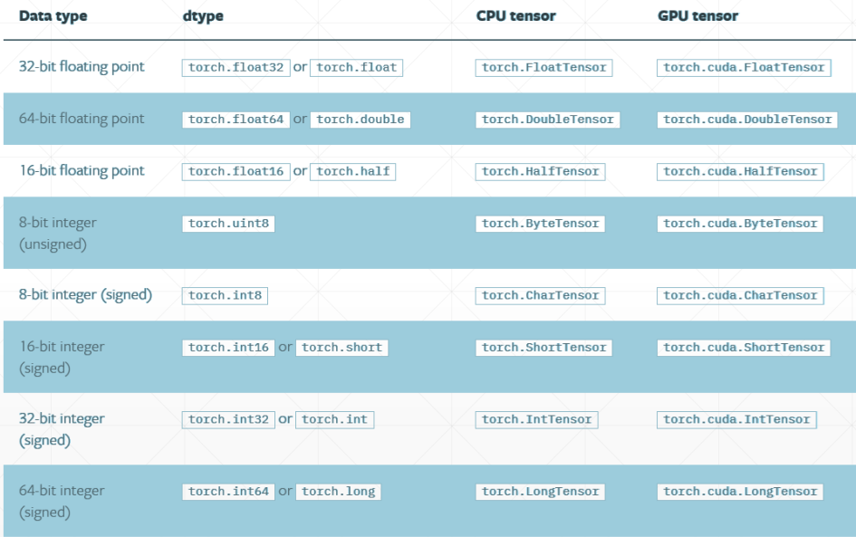​

### 常用类型

* FloatTensor
* DoubleTensor
* ByteTensor
* IntTensor
* LongTensor

## 标量

​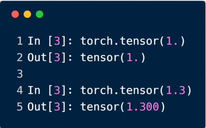

​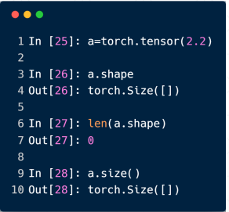​

常用来表示 Loss

## 一维张量

​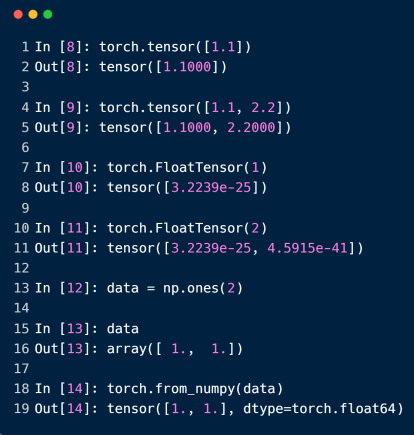

​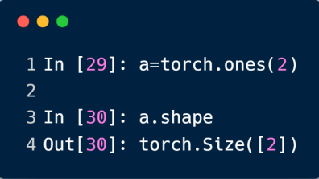​​

有三种方式：

* 给定内容生成一维张量
* 给定维度大小生成一维张量
* 从 np 中得到一维张量

常用于 Bias 神经元的偏置，和 Linear Input

## 二维张量

> dim、size() 和 shape 的区分。对于一个维度为 [2, 2] 这样的张量，它的：
>
> * dim 为 2，也就是数学上的 Rank，秩；
> * size() 和 shape 则返回这个张量的形状，size() 是方法，shape 是属性；

​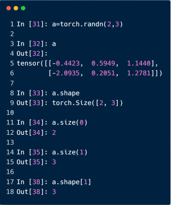​

常用来表示带有 Batch 的 Linear Input，例如 [4, 784]

## 三维张量

​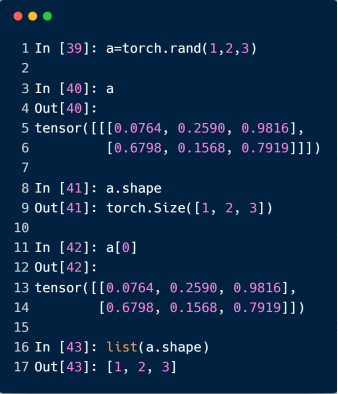​

常用来表示带有 Batch 的 RNN Input，例如 [10, 20, 100]，表示一句话有 10 个单词 W，我们送入 20 句话进行训练 Sentence，每个单词用个 100 长度的一维向量表示

## 四维张量

​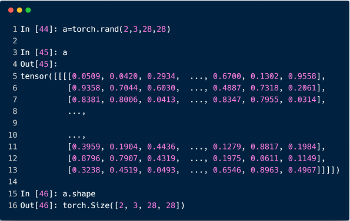​

常用来表示 CNN，例如 [b, c, h, w]

## 获取张量的大小

用 numel 方法，即 num of element

​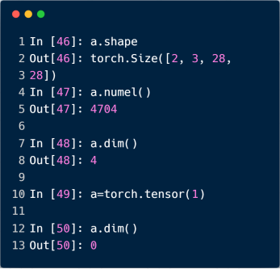​

# 创建 Tensor

## 创建 Tensor

用 torch.FloatTensor 创建 Tensor：

* 当接收到一个 List，则根据现有数据创建 Tensor
* 当接收到不是 List，则根据维度创建 Tensor

​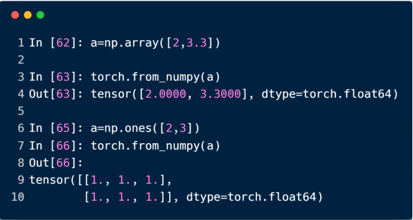​

## 创建未初始化的 Tensor

* Torch.empty()
* Torch.FloatTensor(d1, d2, d3)
* Torch.IntTensor(d1, d2, d3)

> NOT torch.FloatTensor([1, 2]) = torch.tensor([1, 2])
>
> 未初始化的数据会有很多极端值，如下，所以记得跟上后续步骤将数据覆盖掉

​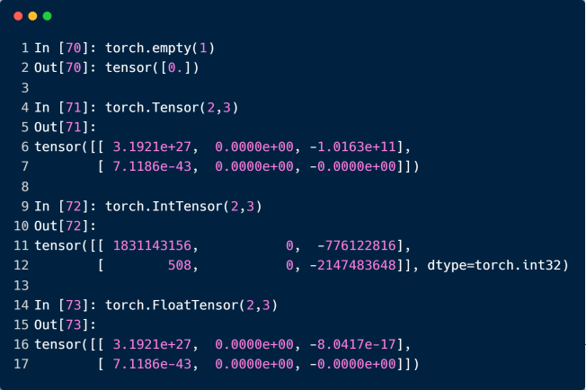​

> PyTorch 如果没有手动配置，默认会生成 FloatTensor
>
> 可以使用 `torch.set_default_tensor_type(torch.DoubleTensor)`​ 设置其他类型

​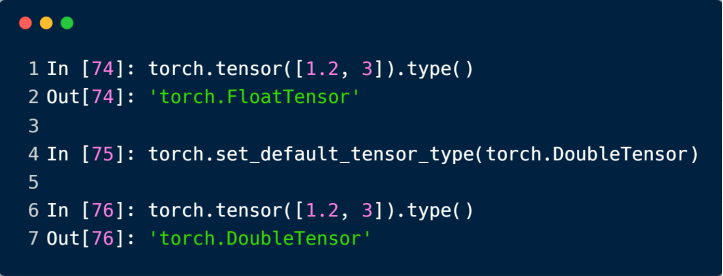​

## 创建均匀分布的 Tensor

* rand

  * 随机从 [0, 1] 分布中生成数据
* rand_like

  * 接收一个 tensor，读取 tensor 的 shape，再送到 rand 函数
* randint

  * 四个参数，例如 randint(1, 10, 3, 3)，生成 [1, 10) 范围内的 3 x 3 的张量

> 均匀采用 0 ~ 10 的 Tensor，要用 x = 10 * torch.rand(d1, d2)，randint 只能采样整数

​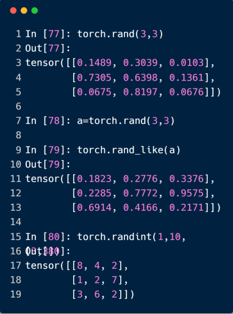​

## 创建正态分布的 Tensor

​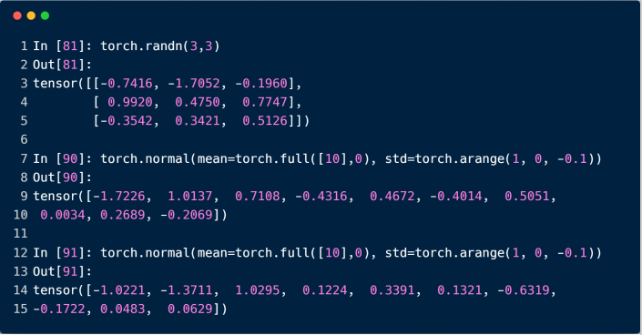​

## 创建指定值的 Tensor

​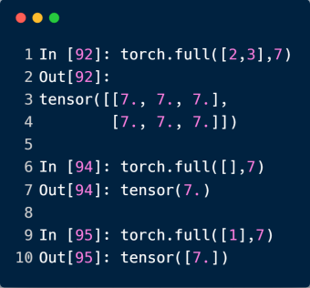​

## 创建递增/递减的 Tensor

​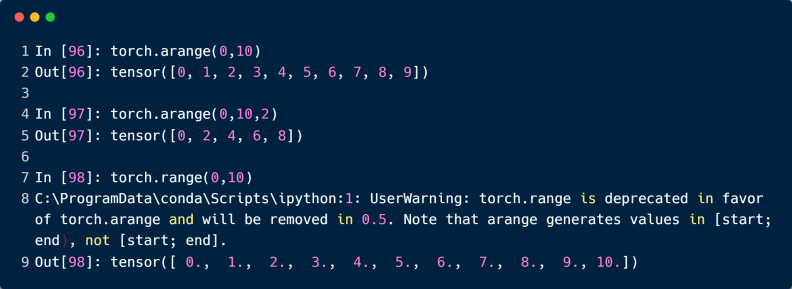​

## 创建等间距的 Tensor

> 注意，arange 参数范围是 [0, 10)，而 linspace 参数范围则是 [0, 10]

​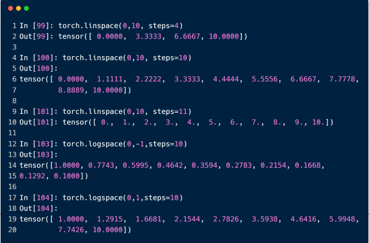​

> logspace 默认是以 10 为底数，可以通过 base 参数设置为 2，10，e 等

## 创建特殊的 Tensor

​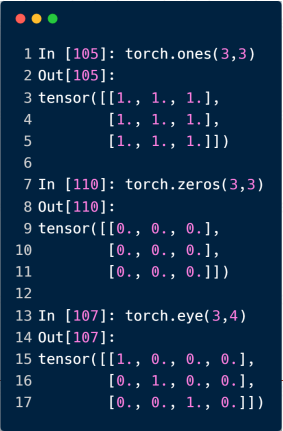​

​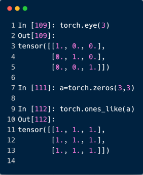​

## 创建随机打散的 Tensor

​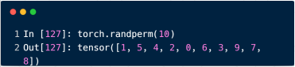​

​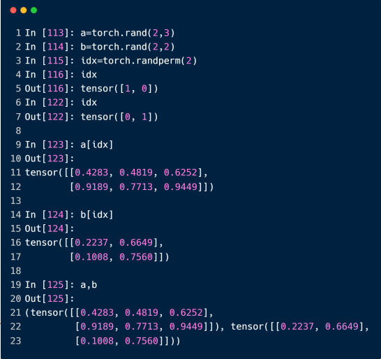​

‍

# 索引和切片

> 关键知识：`0:28:2`​ 对应 `start:end:step`​，不包含 end

## 索引前/后 N 个

​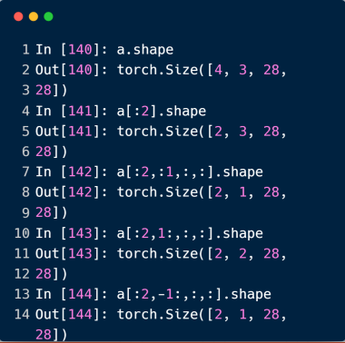​

## 隔行索引

​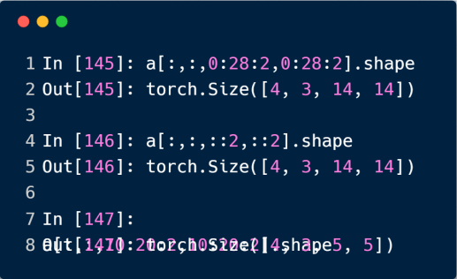​

## 指定索引采样

​`data.index_select(0, torch.tensor([0, 2]))`​，表示在第 0 个维度上，取 0 和 2 两个索引的数据

​`data.index_select(1, torch.tensor([1, 2]))`​，表示在第 1 个维度上，取 1 和 2 两个索引的数据

​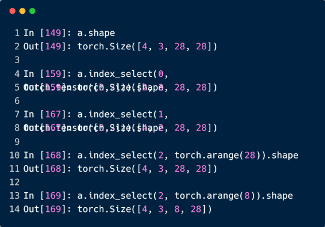​

## ...的使用

> 当有 ... 出现时，右边的索引需要理解为最右边的维度。意思就是 ... 必须能被推测出代表哪几个维度才行
>
> 例如：`[0, ..., ::2]`​ 和 `[0, :, :, ::2]`​ 等价，... 只是简化写法罢了

​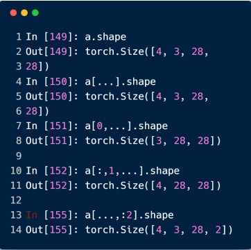​

## 根据掩码索引

> 缺点是会将索引后的数据打平。

​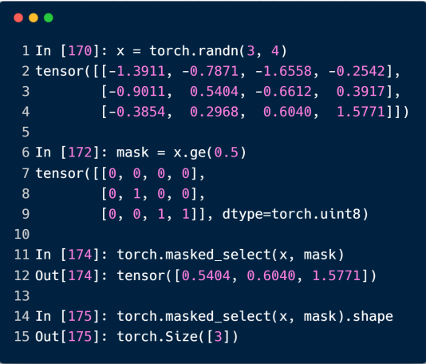​

​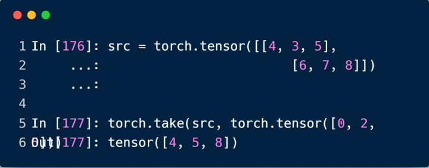​

# 维度变换

## view / reshape 维度变换

> 只要保证 numel() 一致即可
>
> 数据的存储 / 维度顺序非常重要，需要时刻记住！

​​

## squeeze / unsqueeze 删减维度 / 增加维度

### unsqueeze 增加维度

> 正数增加维度是在指定索引的前面增加；负数增加维度是在指定索引的后面增加
>
> 尽量不要使用负数增加维度，易混淆
>
> 参数取值在 [-a.dim() - 1, a.dim()]，即 [-5, 4]

​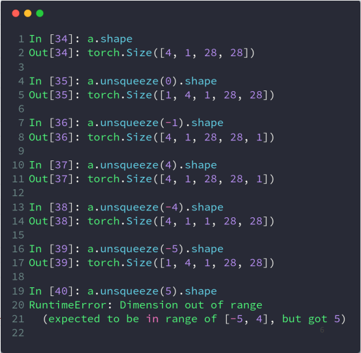

​​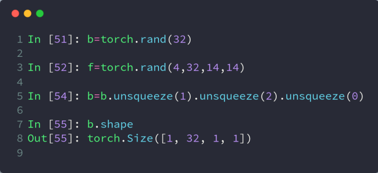​

> 配合扩张 Broadcasting 操作，就可以很方便的给图像上的每个像素添加一个偏置了

### squeeze 删减维度

不指定参数就将所有 dim 为 1 的维度删除

​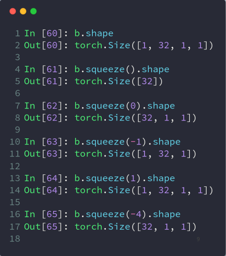​

## transpose / t / permute 维度转置

> t() 只能用于二维张量
>
> transpose() 可以指定参数交换指定维度
>
> view 会导致维度顺序关系变得模糊，所以需要人为跟踪

​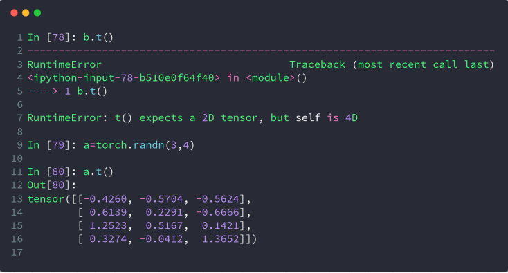​

​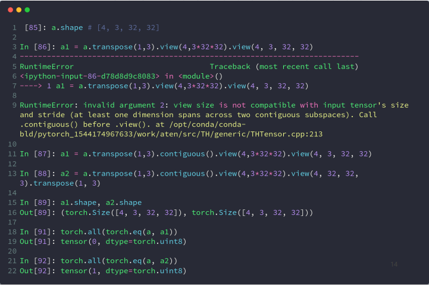

> [b, h, w, c] 是 Numpy 存储图片的格式，所以需要这一步才能到处 Numpy
>
> permute 可以一步到位，直接调整多个维度的顺序

​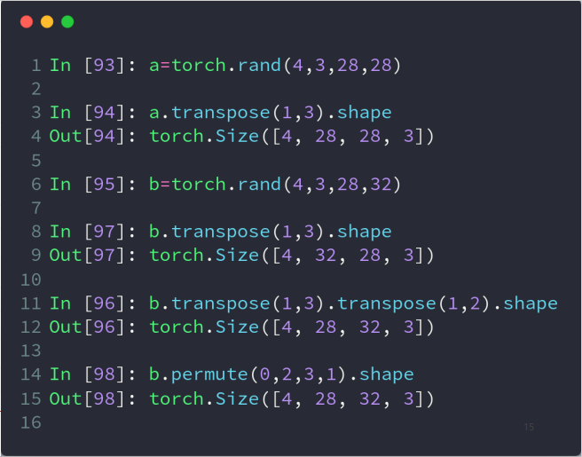​

## expand / repeat 维度扩展

* expand：broadcasting

  * 不会主动复制数据，只有维度为 1 的才能扩张成其他维度
* repeat：memory copied

  * 会发生实实在在的内存拷贝
  * 和 expand 参数区别是，repeat 参数指的是每一个维度要拷贝的次数

​​

​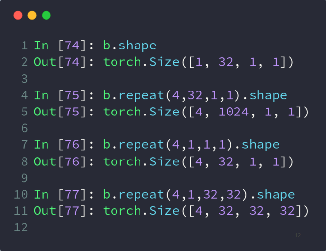​
