# Broadcasting

自动扩展维度语法糖

## 关键点

* A 和 B 张量做 broadcasting，如果 B 前面缺失一个维度，则自动在前面插入一个维度
* 插入的维度大小为 1，接下来会自动将其维度大小为 1 的维度扩张到和 A 张量相同位置维度一样的大小
* 例子：Bias [32, 1, 1] -> [1, 32, 1, 1] -> [4, 32, 14, 14]

所以 broadcasting 的本质就是 unsqueeze + expand

## 案例

* for actual demanding

  * [class, students, scores]
  * Add bias for every students: +5 score
  * [4, 32, 8] + [4, 32, 8]
  * [4, 32, 8] + [5.0]
* boardcasting 会自动完成：[5.0].unsqueeze(0).unsqueeze(0).expand(A) 这个操作

## 适用情况

* Match from **==Last==** dim!

  * If current dim = 1, expand to same
  * If either has no dim, insert one dim and expand to same
  * otherwise, NOT broadcasting-able

例如：[4, 32, 14, 14] + [2, 32, 14, 14] 不可以进行，因为

* Dim 0 has dim, can NOT insert and expand to same
* Dim 0 has distinct dim, NOT size 1
* So NOT broadcasting-able

## 理解

从最后一个维度开始匹配 match from last dim

因为人们相信高维的东西都是相同的，只有低维的才会针对不同的情况有不同的数据

例如对于 [4, 3, 32, 32] +

* [32, 32]，表示在所有照片，所有通道上都叠加一个相同的 Map
* [3, 1, 1]，表示在所有照片，不同通道上叠加设定的值，例如 R 通道上都加 0.5，G 通道上都加 0.4，B 通道上都加 0.3
* [1]，表示在所有照片，所有通道，所有像素点上都叠加一个相同的值

# 合并与分割

## cat

例如 a 是 [class1-4, students, scores]，b 是 [class5-9, students, scores]

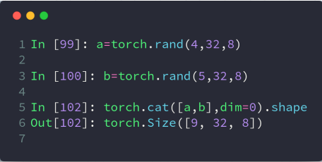

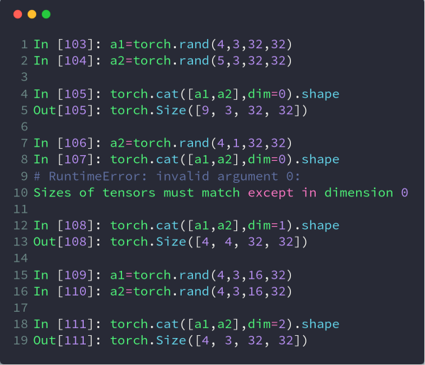

## stack

stack 和 cat 的区别是 stack 会创建一个新的维度

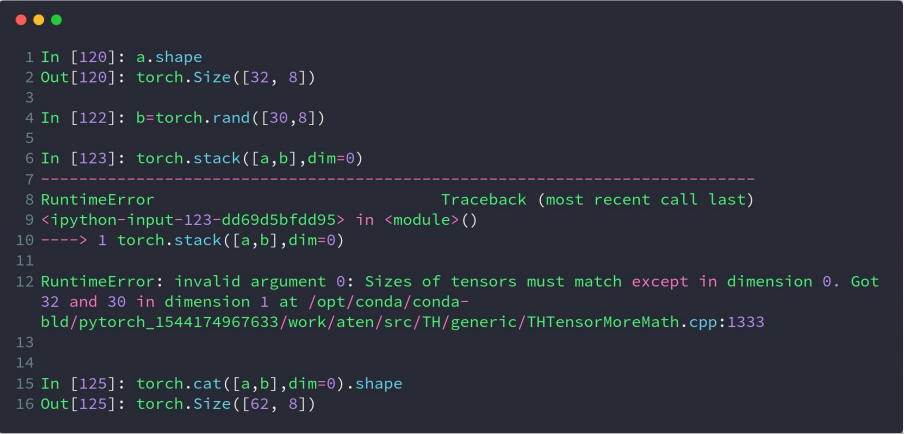

## split

按长度进行拆分，用 List 作为参数的话，可以指定拆分后的张量在指定维度的长度，不用 List 的话就表示根据参数进行均分

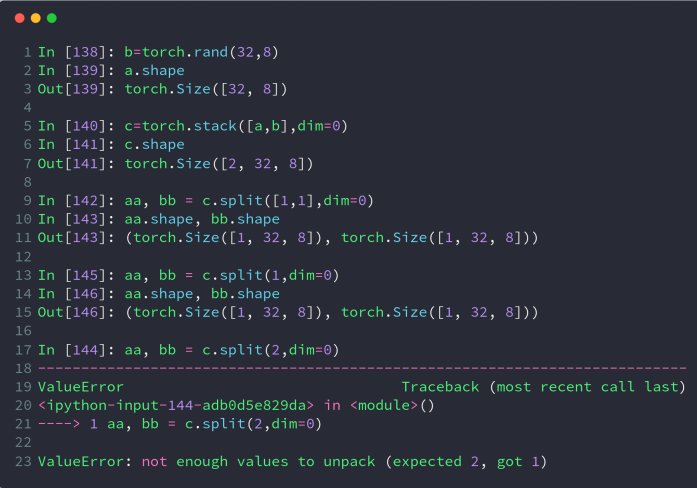

## chunk

按数量进行拆分，上面报错的例子，如果用 chunk 就不会报错，因为 chunk 里面的参数 2 指定了要拆分成两个块，而 split 里面的 2 指定了用长度为 2 进行拆分，而维度 0 一共就 2 个，所以用 split 指定 2 拆分后，就只能得到一个张量，不能用 aa, bb 两个张量进行接收，而用 chunk 就不会有这个问题

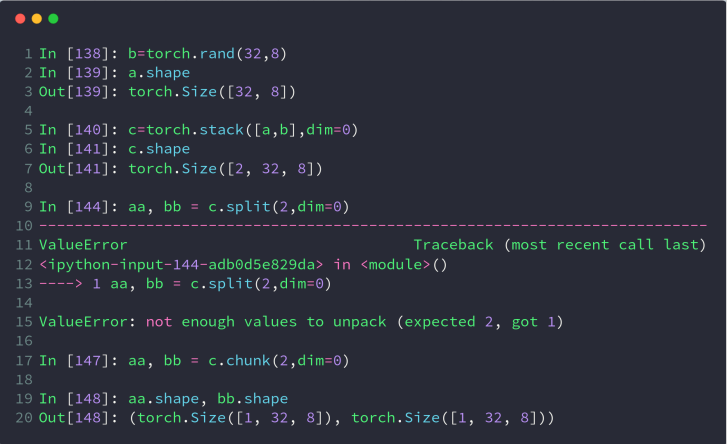

# 数学运算

## 加减乘除

这里就用到了前面所讲的 broadcasting

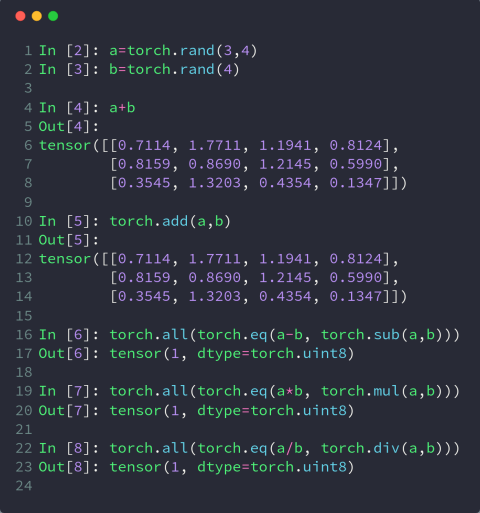

## 矩阵乘法

有三种方式

* Torch.mm

  * 只适用于二维张量
* Torch.matmul
* @

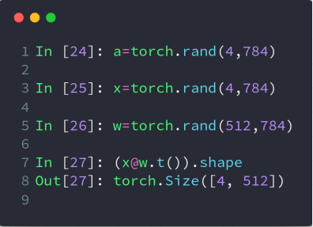

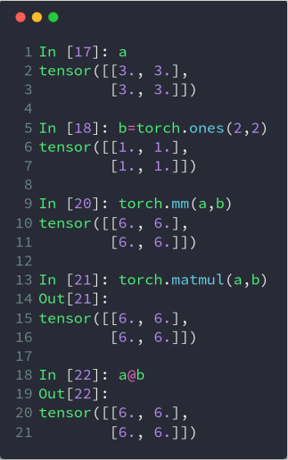

高维矩阵乘法实际上也是对最后两维进行矩阵乘法运算，本质就是支持多个矩阵对并行相乘

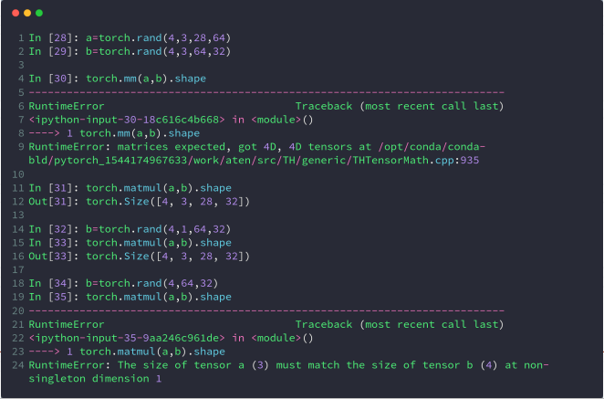

注意，broadcasting 也在其中发挥了作用

## 次方运算

log 运算默认以 e 为底，使用 log2 或 log10 进行其他底数的运算

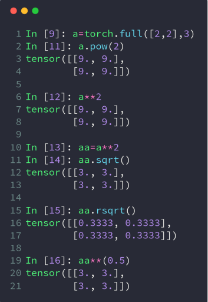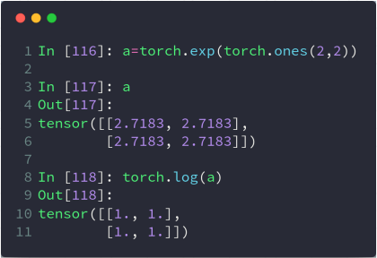

## 取近似运算

floor 往下走，ceil 往上走，trunc 取整数部分，frac 取小数部分，round 四舍五入

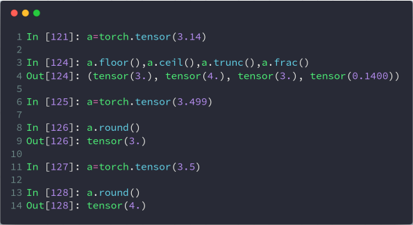

## 裁剪运算

一个参数表示小于设定参数的变为设定参数，两个参数表示（min，max），不在这个区间的设置为参数值，如下

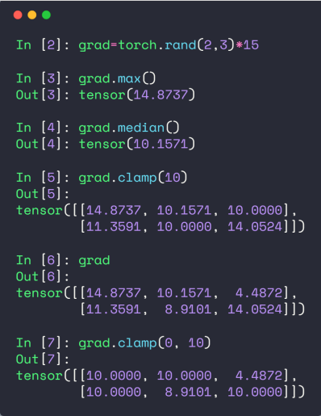

# 属性统计

## 范数

### vector norm vs. matrix norm

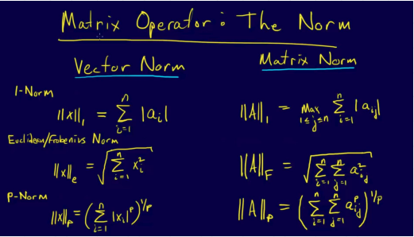

### norm 运算

对哪个维度计算范式，就会消掉哪个维度哦

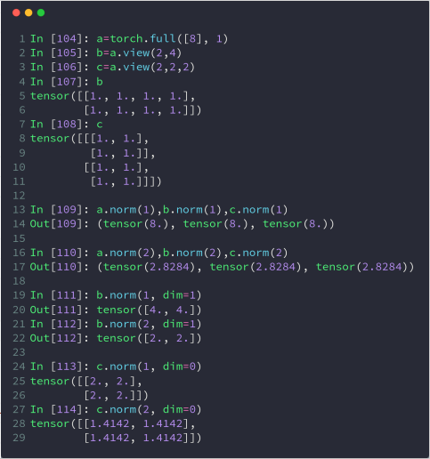

## min / max / sum / mean / prod

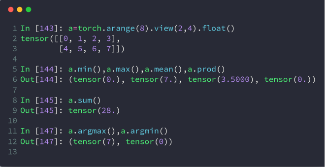

## argmin / argmax

注意，它会默认把所有维度都打平，如果不想被打平，需要指定 dim

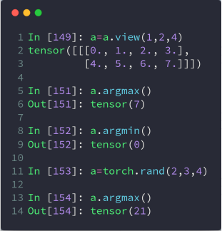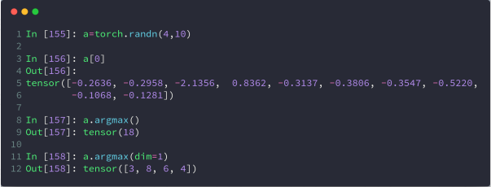

## dim 和 keepdim

正常情况下，在哪个维度 dim 运算，就会消掉哪个维度。keepdim 设置 true 可以保证 dim 不被消掉

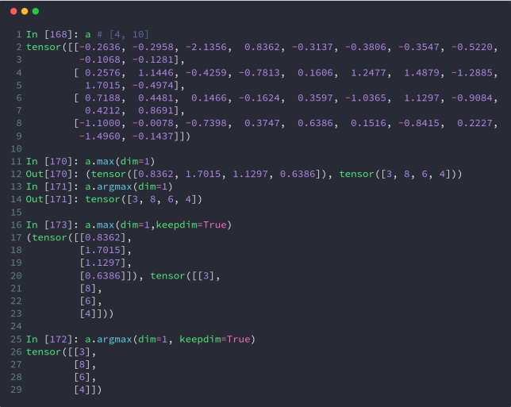

## topk 和 kthvalue

topk 比 max 返回更多的数据

kthvalue 返回的是第 k 小的数和索引

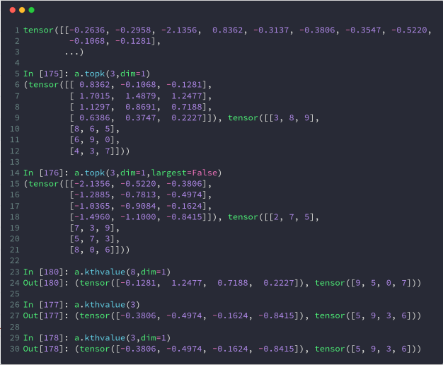

## \>, >=, <, <=, !=, ==

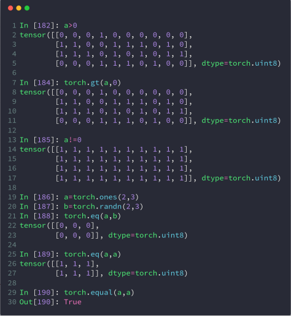

# 高阶操作

## where

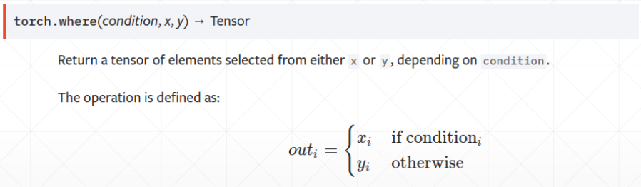

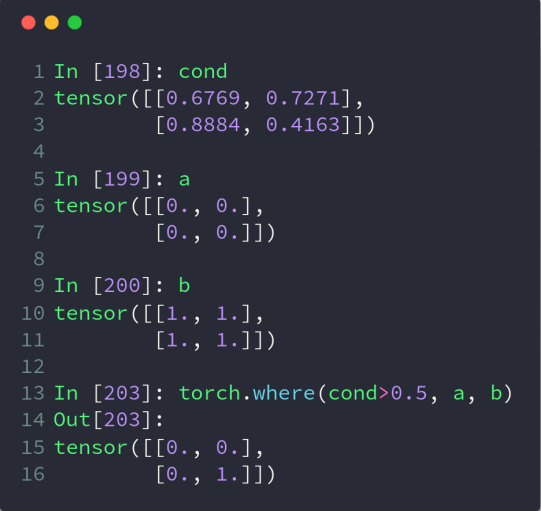

where 可以方便的将数据放到 GPU 上进行并行处理

## gather

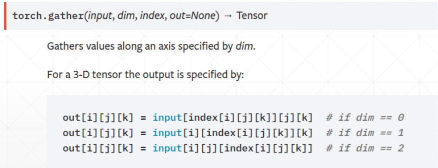

简单来说就是查表操作，比如有 [dog, cat, whale] 标签表，因为 PyTorch 里不能用字符串，所以预测我们得到结果张量为 [1, 0, 1, 2]，如果我们想根据索引查到对应的 Label，即 [cat, dog, cat, whale] 这样的结果，gather 方法就可以帮我们完成这件事

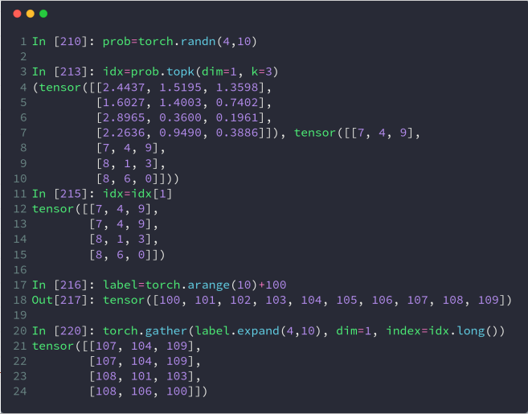
