# 常见函数的梯度

## 基础

* 导数 derivative
* 偏微分 partial derivative
* 梯度 gradient

$$
\nabla f=\left(\frac{\partial f}{\partial x_1};\frac{\partial f}{\partial x_2};\ldots;\frac{\partial f}{\partial x_{n}}\right)
$$

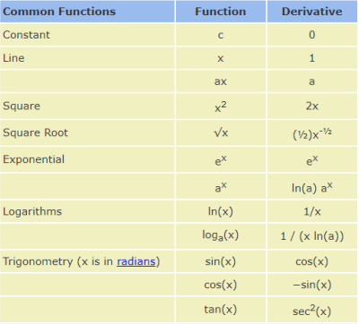

# 常见激活函数及其梯度

## Sigmoid / Logistic

$$
f\left(x\right)=\sigma\left(x\right)=\frac{1}{1+e^{-x}}
$$

$$
\begin{align*}\frac{\mathrm{d}}{\mathrm{d}x}\sigma\left(x\right)={} & \frac{\mathrm{d}}{\mathrm{d}x}\left(\frac{1}{1+e^{-x}}\right)\\[10 pt] ={} & \frac{e^{-x}}{\left(1+e^{-x}\right)^2}\\[14 pt] ={} & \frac{\left(1+e^{-x}\right)-1}{\left(1+e^{-x}\right)^2}\\[10 pt] ={} & \frac{1+e^{-x}}{\left(1+e^{-x}\right)^2}-\left(\frac{1}{1+e^{-x}}\right)^2\\[10 pt] ={} & \sigma\left(x\right)-\sigma\left(x\right)^2\\[6 pt] \sigma^{\prime}={} & \sigma\left(1-\sigma\right)\end{align*}
$$

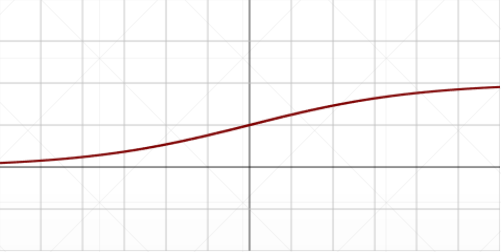

缺点，当 x 趋近于正无穷或负无穷时，$\sigma$ 趋近于 1 或 0，所以它的导数 $\sigma'$ 就会趋近于 0，造成梯度弥散

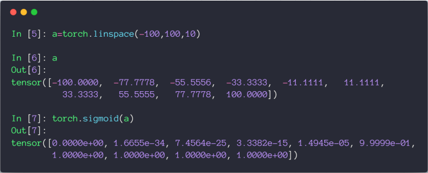

## Tanh

$$
\begin{align*}f\left(x\right)=\tanh\left(x\right)=\frac{\left(e^{x}-e^{-x}\right)}{\left(e^{x}+e^{-x}\right)}\\ =2{sigmoid}\left(2x\right)-1\end{align*}
$$

$$
\begin{align*}\frac{\mathrm{d}}{\mathrm{d}x}\tanh\left(x\right)&=\frac{\left(e^{x}+e^{-x}\right)\left(e^{x}+e^{-x}\right)-\left(e^{x}-e^{-x}\right)\left(e^{x}-e^{-x}\right)}{\left(e^{x}+e^{-x}\right)^2}\\ &=1-\frac{\left(e^{x}-e^{-x}\right)^2}{\left(e^{x}+e^{-x}\right)^2}\\[14 pt] &=1-\tanh^2\left(x\right)\end{align*}
$$

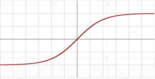

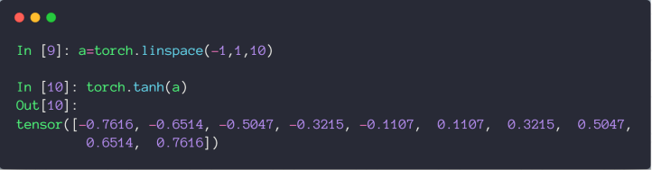

## ReLU

全称：Rectified Linear Unit

$$
f\left(x\right)=\begin{cases}0 & \text{for }x<0\\ x & \text{for }x\ge0\end{cases}
$$

$$
f^{\prime}\left(x\right)=\begin{cases}0 & \text{for }x<0\\ 1 & \text{for }x\ge0\end{cases}
$$

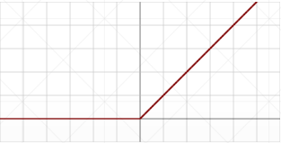

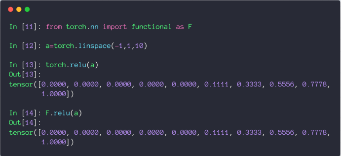

# 常见Loss及其梯度

## Mean Squared Error

注意 loss 和 L2 范式的区别如下

* loss = $\sum\left\lbrack y-\left(xw+b\right)^{}\right\rbrack^2$
* L2-norm = $\left\Vert y-\left(xw+b\right)\right\Vert_2$
* loss = $norm\left(y-\left(xw+b\right)\right)^2$

用 `torch.autograd.grad` 求参数的导数时，需要保证参数的 requires_grad 属性为 True，然后重新生成计算图

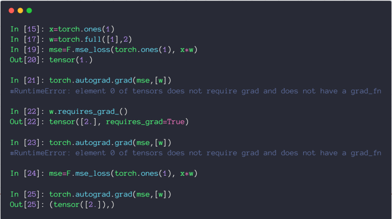

也可以用 `backward` 方法自动计算所有标记为可以求导的参数，赋值到参数的 grad 属性上

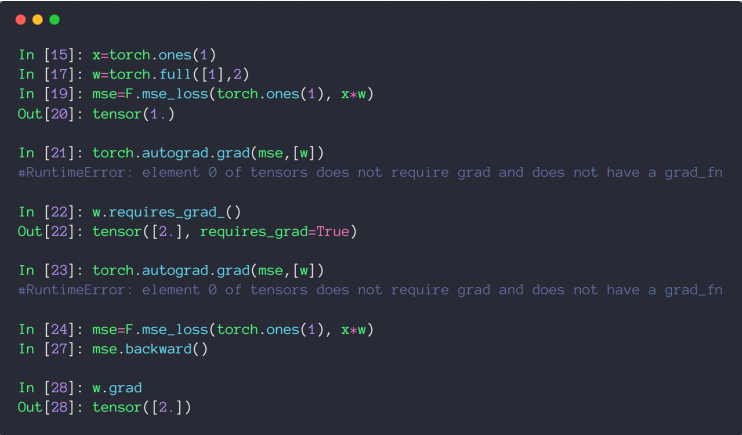  

## Cross Entropy Loss

### Softmax激活函数

和 Sigmoid 激活函数都可以返回 0-1 的近似概率值，但 Softmax 可以保证计算后的所有值的和为 1，同时会把大的值放的更大，小的值压缩到更小的空间~

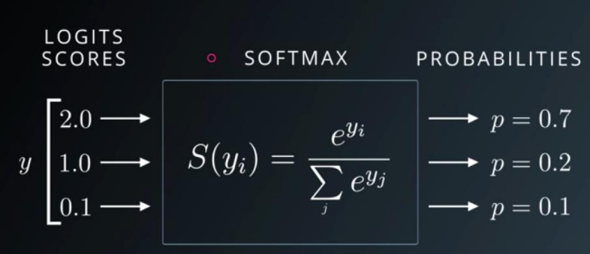

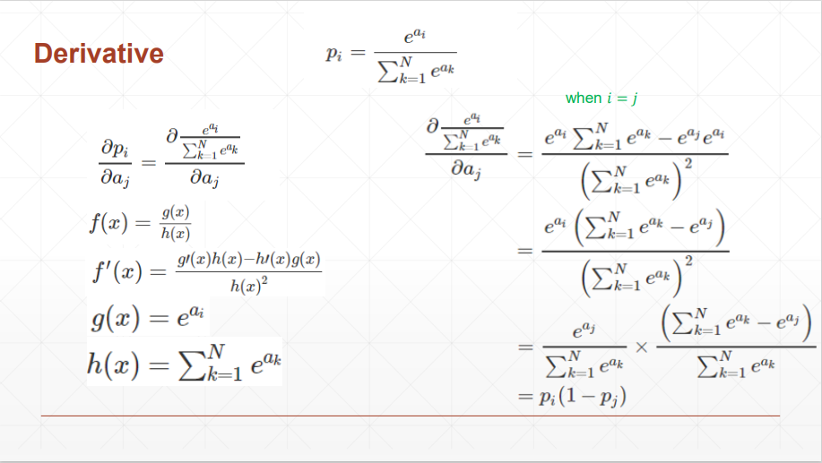

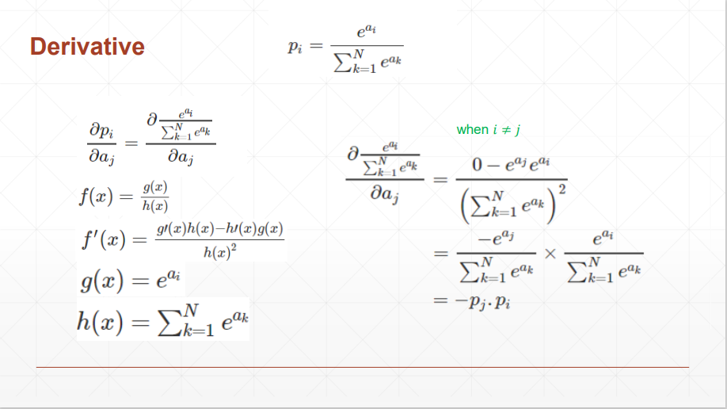

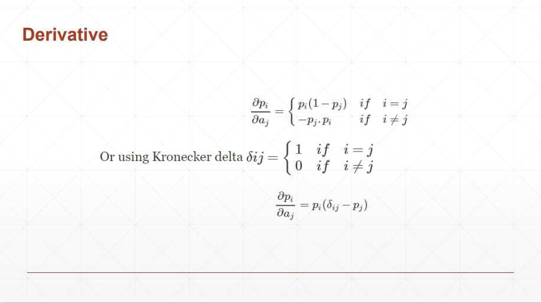

### 代码案例

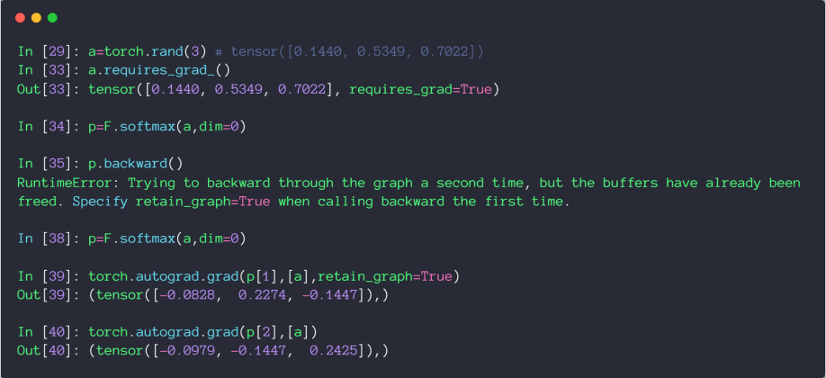

结论：当 i 和 j 相等时，导数为正，不等时，导数为负

# 感知机的梯度推导

## 单层感知机

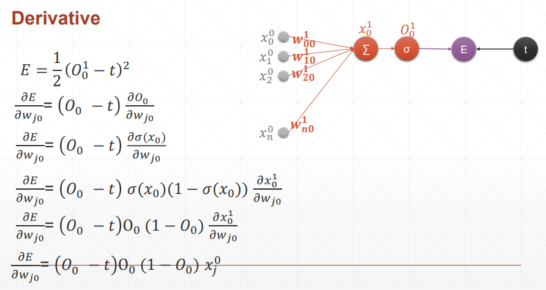


结论：损失函数对哪个参数求导，就和哪个参数有关，简洁美

### 代码示例

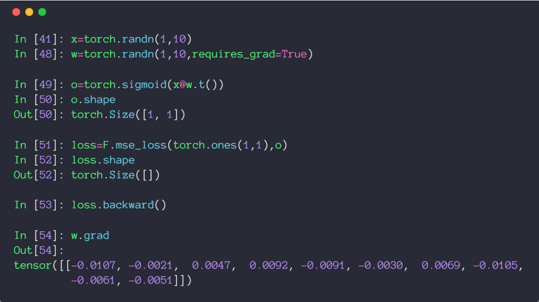

## 多层感知机

在梯度推导过程中，很巧妙的消掉了没有对 $W_{jk}$ 产生影响的部分，只有 $O_{k}-t_{k}$ 才会对 $W_{jk}$ 产生影响，所以求和符号就去掉了

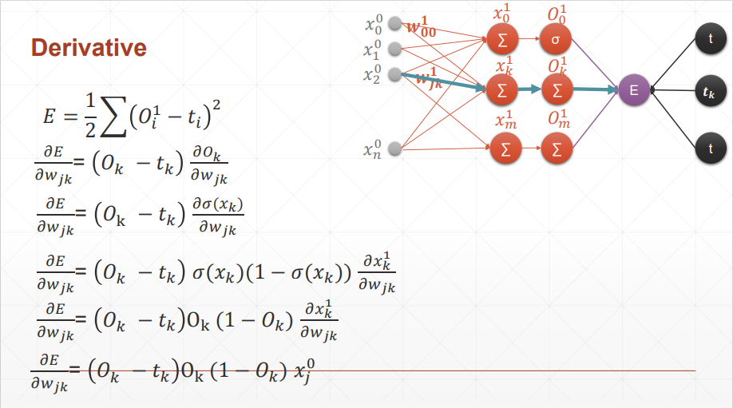

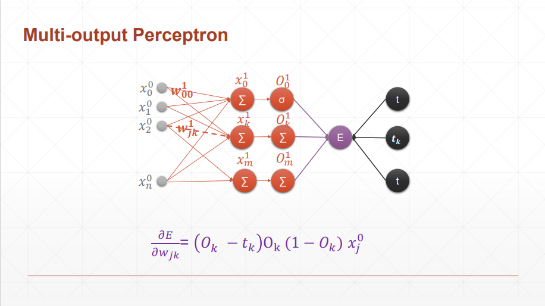

结论：可以看到和单层感知机的区别就是 $O_0$ 变成了 $O_{k}$

### 代码示例

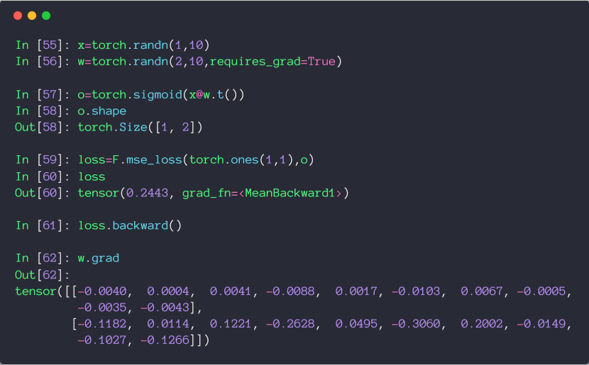 

这里求损失函数时，应该写成 (1, 2)，为什么写成 (1, 1) 也不报错呢，因为符合 broadcasting，自动扩张了维度

# 链式法则

## 基本规则

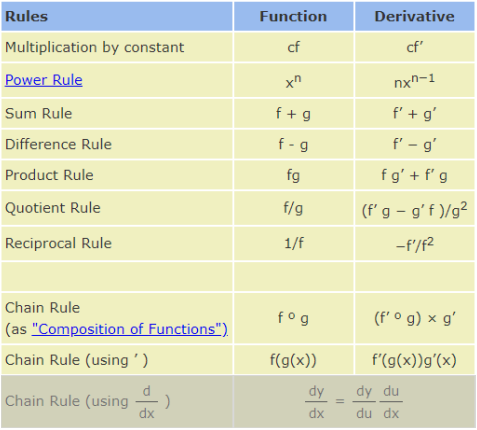

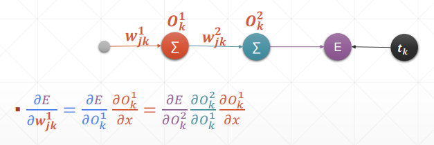

## 代码示例

可以验证链式法则结果的正确性

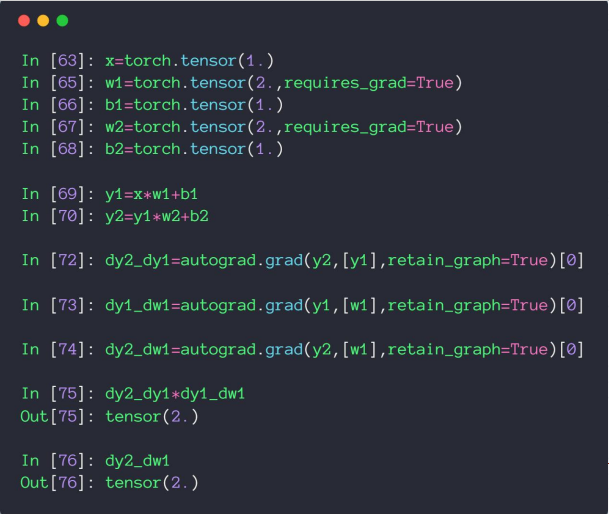

## 反向传播推导

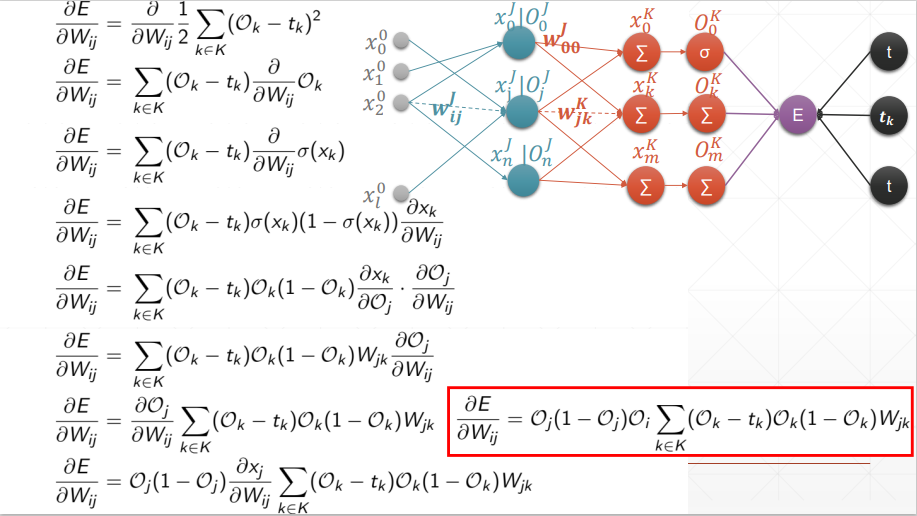

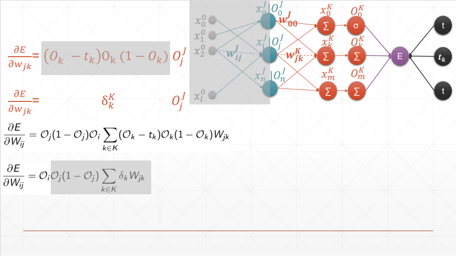

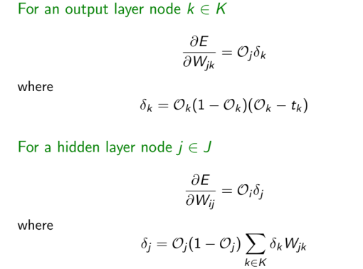

太优雅了，一环套一环的完成了反向传播

‍# 优化小实例

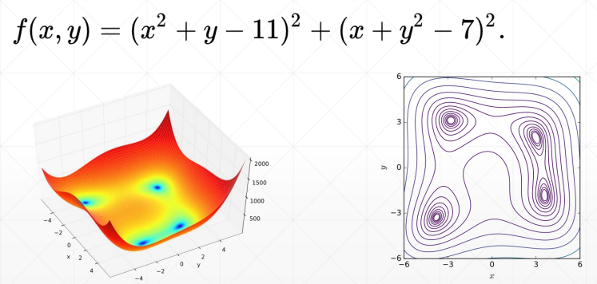

四个最小解

* f(3.0, 2.0) = 0.0
* f(-2.805118, 3.131312) = 0.0
* f(-3.779310, -3.283186) = 0.0
* f(3.584428, -1.848126) = 0.0

```python
import  numpy as np
from    mpl_toolkits.mplot3d import Axes3D
from    matplotlib import pyplot as plt
import  torch

def himmelblau(x):
    return (x[0] ** 2 + x[1] - 11) ** 2 + (x[0] + x[1] ** 2 - 7) ** 2

x = np.arange(-6, 6, 0.1)
y = np.arange(-6, 6, 0.1)
print('x,y range:', x.shape, y.shape)
X, Y = np.meshgrid(x, y)
print('X,Y maps:', X.shape, Y.shape)
Z = himmelblau([X, Y])

fig = plt.figure('himmelblau')
ax = fig.add_subplot(projection = '3d')
ax.plot_surface(X, Y, Z)
ax.view_init(60, -30)
ax.set_xlabel('x')
ax.set_ylabel('y')
plt.show()


# [1., 0.], [-4, 0.], [4, 0.]
x = torch.tensor([-4., 0.], requires_grad=True)
optimizer = torch.optim.Adam([x], lr=1e-3)
for step in range(20000):

    pred = himmelblau(x)

    optimizer.zero_grad()
    pred.backward()
    optimizer.step()

    if step % 2000 == 0:
        print ('step {}: x = {}, f(x) = {}'
               .format(step, x.tolist(), pred.item()))

```
