# Logistic Regression

## Q1 why not maximize accuracy?

$$
acc.=\frac{\sum I\left(pred_{i}==y_{i}\right)}{len\left(Y\right)}
$$

如果最小化 accuracy，==会造成 gradient = 0 的现象==。因为用 sigmoid 做激活函数，小于 0.5 判断为 0，大于 0.5 判断为 1，如果参数 w 从 0.4 提升到 0.45，但因为还是小于 0.5，所以预测的类别没有发生变化，accuracy 也没有变，导致梯度不就为 0 嘛。

会造成梯度不连续的现象。还是刚才的例子，如果 w 从 0.499 变到 0.501，只有微小的提升，但是预测的类别就发生了变化，导致 accuracy 突变。也就造成了刚刚梯度都还是 0，但这次就突然变了很大的一个值，就是这种梯度不连续的现象。

所以在分类问题上，不会用 accuracy 作为优化目标。

## Q2 why call logistic regression

因为用了 sigmoid 激活函数，所以称它为 logistic

如果使用 MSE 损失函数，则可以称之为 regression，因为 MSE 就是想将比如 P(0.7) 逼近 P(1)，所以可以称之为 regression

而如果用 CrossEntropy 作为损失函数，则应该称为 classification


# Cross Entropy

## Entropy

$$
Entropy=-\sum_{i}P\left(i\right)\log P\left(i\right)
$$

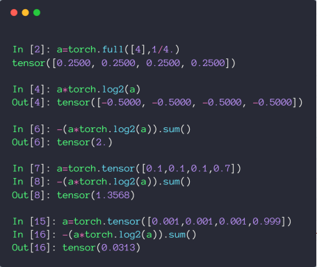

## CrossEntropy

p 定义为真实分布，q 是模型学习到的分布，则 CrossEntropy 的定义如下

$$
\begin{align*}H\left(p,q\right)&=-\sum p\left(x\right)\log q\left(x\right)\\[10 pt] &=H\left(p\right)+D_{KL}\left(p\left|q\right.\right)\end{align*}
$$

KL 散度，用来衡量两个分布间的差异，详情：[Kullback-Leibler(KL)散度介绍](https://zhuanlan.zhihu.com/p/100676922)

当 q = p，即完全学习到了真实分布时，CrossEntropy = Entropy

对于分类问题，通常使用 one-hot 编码，这种情况下，真实分布 p 就类似 [1, 0, 0, 0] 这种，H(p) 的值就是 entropy = 1log1 = 0，所以对于分类问题，CrossEntropy 就等于用 KL 散度来衡量分布间的差异

通常情况下，将没有经过激活函数的输出称为 Logits，如下

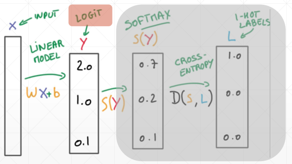

### 案例

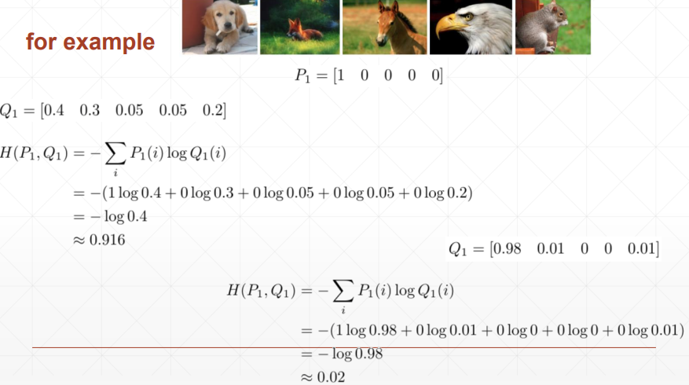

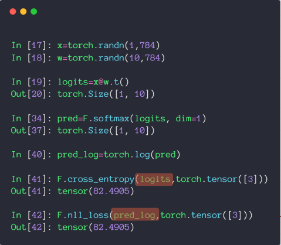

注意，在 pytorch 中，cross_entropy 就等于 softmax + log + nll_loss，所以对于 logits，直接扔到 cross_entropy 中就行

‍# 全连接网络多分类小实战

## 底层 API 版

```python
import  torch
import  torch.nn as nn
import  torch.nn.functional as F
import  torch.optim as optim
from    torchvision import datasets, transforms

batch_size=200
learning_rate=0.01
epochs=10

train_loader = torch.utils.data.DataLoader(
    datasets.MNIST('../data', train=True, download=True,
                   transform=transforms.Compose([
                       transforms.ToTensor(),
                       transforms.Normalize((0.1307,), (0.3081,))
                   ])),
    batch_size=batch_size, shuffle=True)
test_loader = torch.utils.data.DataLoader(
    datasets.MNIST('../data', train=False, transform=transforms.Compose([
        transforms.ToTensor(),
        transforms.Normalize((0.1307,), (0.3081,))
    ])),
    batch_size=batch_size, shuffle=True)


w1, b1 = torch.randn(200, 784, requires_grad=True),\
         torch.zeros(200, requires_grad=True)
w2, b2 = torch.randn(200, 200, requires_grad=True),\
         torch.zeros(200, requires_grad=True)
w3, b3 = torch.randn(10, 200, requires_grad=True),\
         torch.zeros(10, requires_grad=True)

torch.nn.init.kaiming_normal_(w1)
torch.nn.init.kaiming_normal_(w2)
torch.nn.init.kaiming_normal_(w3)

def forward(x):
    x = x@w1.t() + b1
    x = F.relu(x)
    x = x@w2.t() + b2
    x = F.relu(x)
    x = x@w3.t() + b3
    x = F.relu(x)
    return x

optimizer = optim.SGD([w1, b1, w2, b2, w3, b3], lr=learning_rate)
criteon = nn.CrossEntropyLoss()

for epoch in range(epochs):

    for batch_idx, (data, target) in enumerate(train_loader):
        data = data.view(-1, 28*28)

        logits = forward(data)
        loss = criteon(logits, target)

        optimizer.zero_grad()
        loss.backward()
        # print(w1.grad.norm(), w2.grad.norm())
        optimizer.step()

        if batch_idx % 100 == 0:
            print('Train Epoch: {} [{}/{} ({:.0f}%)]\tLoss: {:.6f}'.format(
                epoch, batch_idx * len(data), len(train_loader.dataset),
                       100. * batch_idx / len(train_loader), loss.item()))


    test_loss = 0
    correct = 0
    for data, target in test_loader:
        data = data.view(-1, 28 * 28)
        logits = forward(data)
        test_loss += criteon(logits, target).item()

        pred = logits.data.max(1)[1]
        correct += pred.eq(target.data).sum()

    test_loss /= len(test_loader.dataset)
    print('\nTest set: Average loss: {:.4f}, Accuracy: {}/{} ({:.0f}%)\n'.format(
        test_loss, correct, len(test_loader.dataset),
        100. * correct / len(test_loader.dataset)))

```

## 高阶 API 版

### nn.ReLU 和 F.relu() 的区别

前者是类风格的 API，后者是函数风格的 API

类风格的要创建实例，然后扔进去。函数风格的可以直接调用

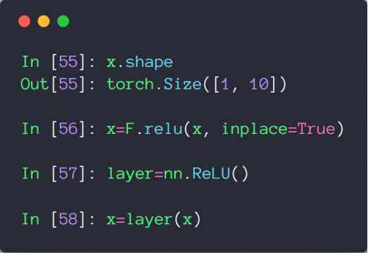

```python
import  torch
import  torch.nn as nn
import  torch.nn.functional as F
import  torch.optim as optim
from    torchvision import datasets, transforms

batch_size=200
learning_rate=0.01
epochs=10

train_loader = torch.utils.data.DataLoader(
    datasets.MNIST('../data', train=True, download=True,
                   transform=transforms.Compose([
                       transforms.ToTensor(),
                       transforms.Normalize((0.1307,), (0.3081,))
                   ])),
    batch_size=batch_size, shuffle=True)
test_loader = torch.utils.data.DataLoader(
    datasets.MNIST('../data', train=False, transform=transforms.Compose([
        transforms.ToTensor(),
        transforms.Normalize((0.1307,), (0.3081,))
    ])),
    batch_size=batch_size, shuffle=True)

class MLP(nn.Module):

    def __init__(self):
        super(MLP, self).__init__()

        self.model = nn.Sequential(
            nn.Linear(784, 200),
            nn.ReLU(inplace=True),
            nn.Linear(200, 200),
            nn.ReLU(inplace=True),
            nn.Linear(200, 10),
            nn.ReLU(inplace=True),
        )

    def forward(self, x):
        x = self.model(x)

        return x

net = MLP()
optimizer = optim.SGD(net.parameters(), lr=learning_rate)
criteon = nn.CrossEntropyLoss()

for epoch in range(epochs):

    for batch_idx, (data, target) in enumerate(train_loader):
        data = data.view(-1, 28*28)

        logits = net(data)
        loss = criteon(logits, target)

        optimizer.zero_grad()
        loss.backward()
        # print(w1.grad.norm(), w2.grad.norm())
        optimizer.step()

        if batch_idx % 100 == 0:
            print('Train Epoch: {} [{}/{} ({:.0f}%)]\tLoss: {:.6f}'.format(
                epoch, batch_idx * len(data), len(train_loader.dataset),
                       100. * batch_idx / len(train_loader), loss.item()))

    test_loss = 0
    correct = 0
    for data, target in test_loader:
        data = data.view(-1, 28 * 28)
        logits = net(data)
        test_loss += criteon(logits, target).item()

        pred = logits.data.max(1)[1]
        correct += pred.eq(target.data).sum()

    test_loss /= len(test_loader.dataset)
    print('\nTest set: Average loss: {:.4f}, Accuracy: {}/{} ({:.0f}%)\n'.format(
        test_loss, correct, len(test_loader.dataset),
        100. * correct / len(test_loader.dataset)))

```

## 激活函数补充

### Leaky ReLU

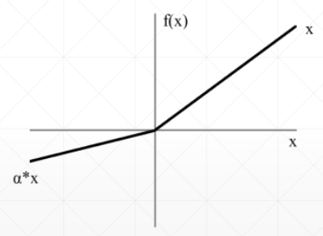

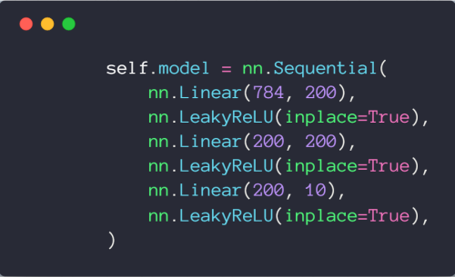

### SELU

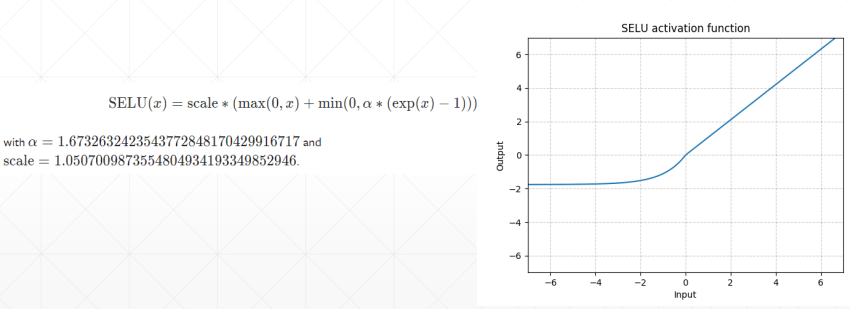

### Softplus

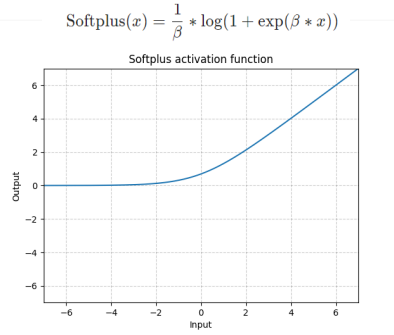

## GPU 加速

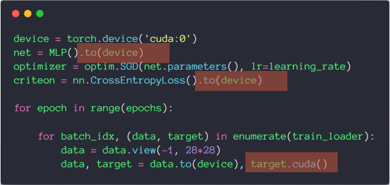

使用 `cuda` 会造成硬编码，所以推荐使用 `to(device)`

## MNIST 实战


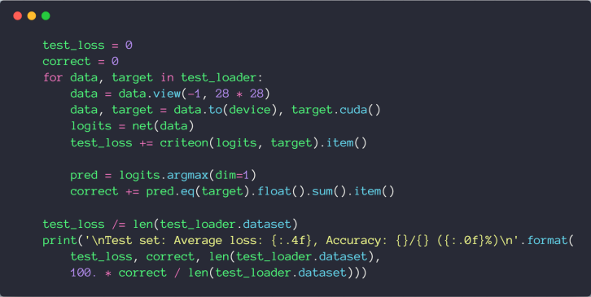

```python
import  torch
import  torch.nn as nn
import  torch.nn.functional as F
import  torch.optim as optim
from    torchvision import datasets, transforms

batch_size=200
learning_rate=0.01
epochs=10

train_loader = torch.utils.data.DataLoader(
    datasets.MNIST('../data', train=True, download=True,
                   transform=transforms.Compose([
                       transforms.ToTensor(),
                       transforms.Normalize((0.1307,), (0.3081,))
                   ])),
    batch_size=batch_size, shuffle=True)
test_loader = torch.utils.data.DataLoader(
    datasets.MNIST('../data', train=False, transform=transforms.Compose([
        transforms.ToTensor(),
        transforms.Normalize((0.1307,), (0.3081,))
    ])),
    batch_size=batch_size, shuffle=True)

class MLP(nn.Module):

    def __init__(self):
        super(MLP, self).__init__()

        self.model = nn.Sequential(
            nn.Linear(784, 200),
            nn.LeakyReLU(inplace=True),
            nn.Linear(200, 200),
            nn.LeakyReLU(inplace=True),
            nn.Linear(200, 10),
            nn.LeakyReLU(inplace=True),
        )

    def forward(self, x):
        x = self.model(x)

        return x

device = torch.device('cuda:0')
net = MLP().to(device)
optimizer = optim.SGD(net.parameters(), lr=learning_rate)
criteon = nn.CrossEntropyLoss().to(device)

for epoch in range(epochs):

    for batch_idx, (data, target) in enumerate(train_loader):
        data = data.view(-1, 28*28)
        data, target = data.to(device), target.cuda()

        logits = net(data)
        loss = criteon(logits, target)

        optimizer.zero_grad()
        loss.backward()
        # print(w1.grad.norm(), w2.grad.norm())
        optimizer.step()

        if batch_idx % 100 == 0:
            print('Train Epoch: {} [{}/{} ({:.0f}%)]\tLoss: {:.6f}'.format(
                epoch, batch_idx * len(data), len(train_loader.dataset),
                       100. * batch_idx / len(train_loader), loss.item()))


    test_loss = 0
    correct = 0
    for data, target in test_loader:
        data = data.view(-1, 28 * 28)
        data, target = data.to(device), target.cuda()
        logits = net(data)
        test_loss += criteon(logits, target).item()

        pred = logits.argmax(dim=1)
        correct += pred.eq(target).float().sum().item()

    test_loss /= len(test_loader.dataset)
    print('\nTest set: Average loss: {:.4f}, Accuracy: {}/{} ({:.0f}%)\n'.format(
        test_loss, correct, len(test_loader.dataset),
        100. * correct / len(test_loader.dataset)))

```

## Visdom 可视化

### 安装及运行

安装 `pip install visdom`

启动服务 `python -m visdom.server`

### 绘制单条曲线

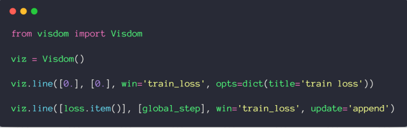

### 绘制多条曲线

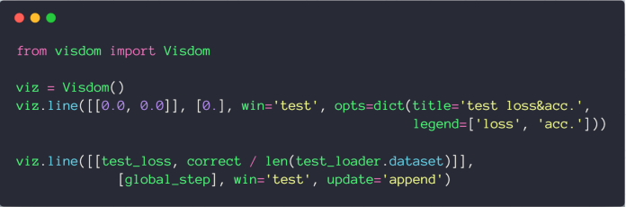

### 绘制图片和文本

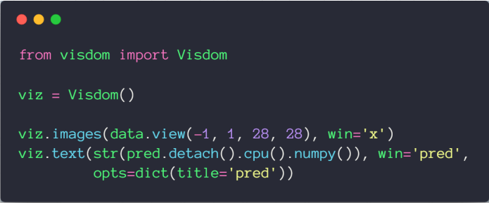

```python
import  torch
import  torch.nn as nn
import  torch.nn.functional as F
import  torch.optim as optim
from    torchvision import datasets, transforms

from visdom import Visdom

batch_size=200
learning_rate=0.01
epochs=10

train_loader = torch.utils.data.DataLoader(
    datasets.MNIST('../data', train=True, download=True,
                   transform=transforms.Compose([
                       transforms.ToTensor(),
                       # transforms.Normalize((0.1307,), (0.3081,))
                   ])),
    batch_size=batch_size, shuffle=True)
test_loader = torch.utils.data.DataLoader(
    datasets.MNIST('../data', train=False, transform=transforms.Compose([
        transforms.ToTensor(),
        # transforms.Normalize((0.1307,), (0.3081,))
    ])),
    batch_size=batch_size, shuffle=True)

class MLP(nn.Module):

    def __init__(self):
        super(MLP, self).__init__()

        self.model = nn.Sequential(
            nn.Linear(784, 200),
            nn.LeakyReLU(inplace=True),
            nn.Linear(200, 200),
            nn.LeakyReLU(inplace=True),
            nn.Linear(200, 10),
            nn.LeakyReLU(inplace=True),
        )

    def forward(self, x):
        x = self.model(x)

        return x

device = torch.device('cuda:0')
net = MLP().to(device)
optimizer = optim.SGD(net.parameters(), lr=learning_rate)
criteon = nn.CrossEntropyLoss().to(device)

viz = Visdom()

viz.line([0.], [0.], win='train_loss', opts=dict(title='train loss'))
viz.line([[0.0, 0.0]], [0.], win='test', opts=dict(title='test loss&acc.',
                                                   legend=['loss', 'acc.']))
global_step = 0

for epoch in range(epochs):

    for batch_idx, (data, target) in enumerate(train_loader):
        data = data.view(-1, 28*28)
        data, target = data.to(device), target.cuda()

        logits = net(data)
        loss = criteon(logits, target)

        optimizer.zero_grad()
        loss.backward()
        # print(w1.grad.norm(), w2.grad.norm())
        optimizer.step()

        global_step += 1
        viz.line([loss.item()], [global_step], win='train_loss', update='append')

        if batch_idx % 100 == 0:
            print('Train Epoch: {} [{}/{} ({:.0f}%)]\tLoss: {:.6f}'.format(
                epoch, batch_idx * len(data), len(train_loader.dataset),
                       100. * batch_idx / len(train_loader), loss.item()))


    test_loss = 0
    correct = 0
    for data, target in test_loader:
        data = data.view(-1, 28 * 28)
        data, target = data.to(device), target.cuda()
        logits = net(data)
        test_loss += criteon(logits, target).item()

        pred = logits.argmax(dim=1)
        correct += pred.eq(target).float().sum().item()

    viz.line([[test_loss, correct / len(test_loader.dataset)]],
             [global_step], win='test', update='append')
    viz.images(data.view(-1, 1, 28, 28), win='x')
    viz.text(str(pred.detach().cpu().numpy()), win='pred',
             opts=dict(title='pred'))

    test_loss /= len(test_loader.dataset)
    print('\nTest set: Average loss: {:.4f}, Accuracy: {}/{} ({:.0f}%)\n'.format(
        test_loss, correct, len(test_loader.dataset),
        100. * correct / len(test_loader.dataset)))

```
