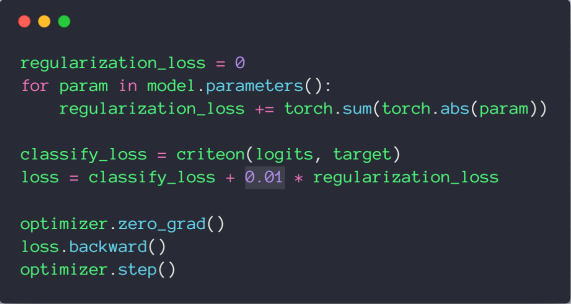
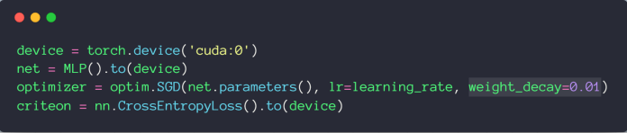
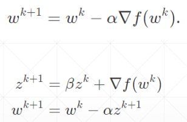
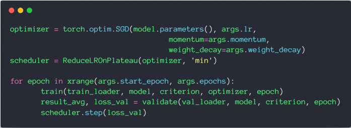
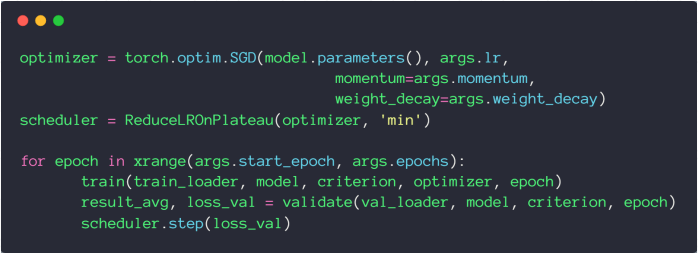
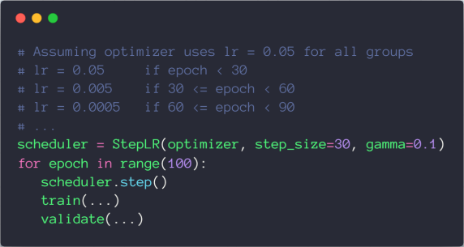
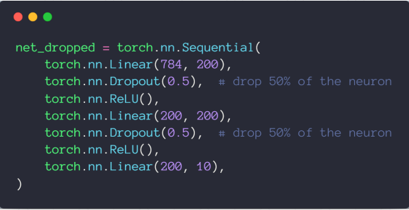
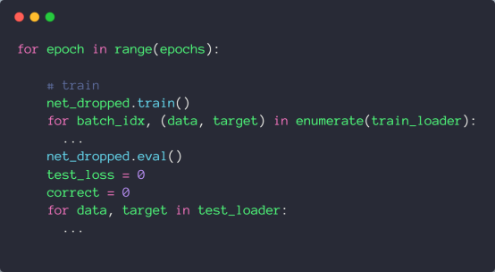

# 过拟合问题

## 欠拟合

当 train acc. is bad 并且 test acc. is bad as well 可以认为是欠拟合，但现在神经网络的学习能力太强了，所以这种问题不常见

## 过拟合

当 train loss and acc. is much better 但是 test acc. is worse 就是过拟合，也就是泛化能力 Generalization Performance 不够，所以目前的主要问题就是如何缓解过拟合问题

## 训练/验证/测试集的划分

对于测试集，我们不能做任何事情，所以通常来说将训练集划分为训练集和验证集

## weight_decay

可以用来尽可能减少参数的值

L1-regularization

$$
J\left(\theta\right)=-\frac{1}{m}\sum_{i=1}^{m}\left\lbrack y_{i}\ln\hat{y}_{i}+\left(1-y_{i}\right)\ln\left(1-\hat{y}_{i}\right)\right\rbrack+\lambda\sum_{i=1}^{n}\left|\theta_{i}\right|
$$

L2-regularization

$$
J\left(W;X,y\right)+\frac12\lambda\cdot\left\Vert W\right\Vert^2
$$

在 pytorch 中，可以方便的通过 weight\_decay 设置 L2-regularization

## 动量 momentum

注意：Adam 中没有 momentum 参数，因为 Adam 已经内部包含了 momentum 的优化

## 学习率衰减

### 使用 ReduceLROnPlateau

当 Loss 平滑时，自动衰减学习率

### 使用 StepLR

达到迭代次数后进行衰减

## Dropout

pytorch 中的 `torch.nn.Dropout(p=dropout_prob)` 值为 1 时表示全部失活

tensorflow 中的 `tf.nn.dropout(keep_prob)` 值为 1 时表示全部保持

注意，当添加了 Dropout 时，需要在训练集和测试集之间用 `net.eval()` 进行切换。因为网络用于测试集时不用 Dropout

