# 什么是卷积神经网络

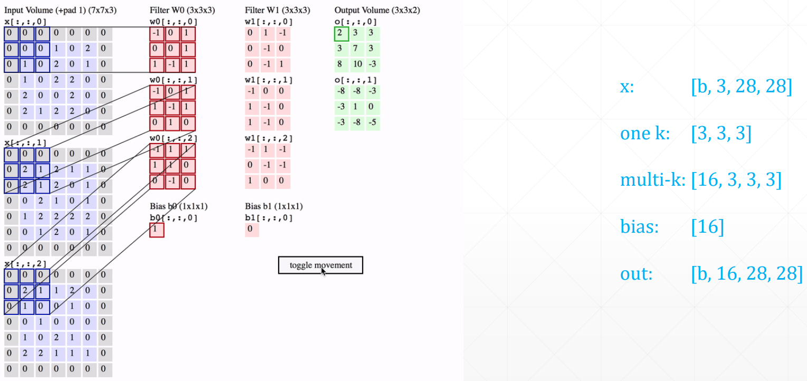

注意，是把一个 kernel 里的三个窗口做完运算后生成的三个值累加起来，得到新的 feature map。对于下一层有 16 个通道，则是把一个 kernel 里的 16 个窗口做完运算后生成的 16 个值累加起来，算作一个新的 feature。

## 代码示例

### 类风格 API

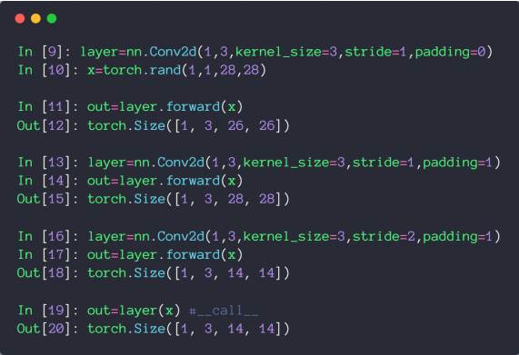

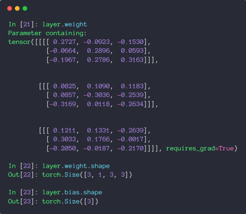

### 函数风格 API

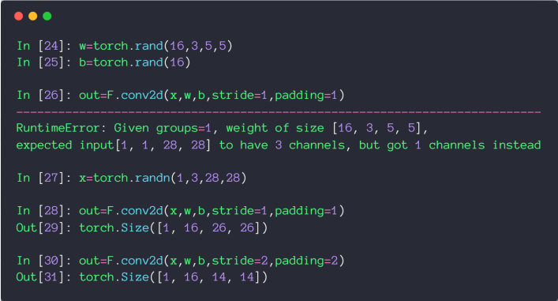

‍
# 池化层和采样

## 池化层

最大池化：取 kernel 里的最大值

平均池化：取 kernel 里的平均值

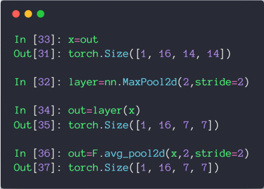

### 上采样

将特征图放大

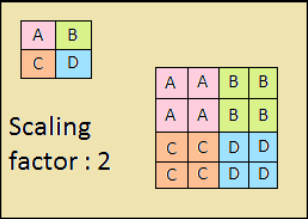

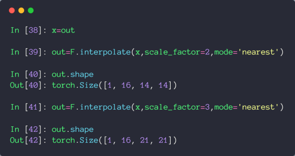


# BatchNorm

## Image Normalization

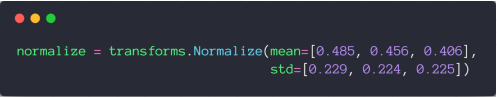

这里的均值和方差是统计了数百万张图片在 RGB 三通道的均值和方差，所以通过这些数，就可以将图片大致缩放到均值为 0，方差为 1 的正态分布上了

## Batch Normalization

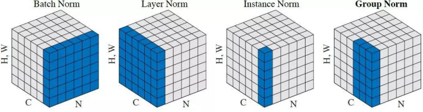

这里只考虑 Batch Norm

注意，它是将 N * H * W 数据合起来进行 Normalization 了，依旧是一个 Batch 里有三个 feature map，就对分别对每个的 feature map，将==所有图片 N，所有宽高 H，W 合并起来==进行 Normalization，这个就叫 Batch Normalization

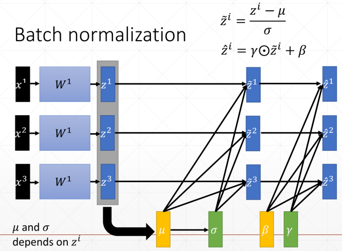

从上图中可以看出 $\mu$ 和 $\sigma$ 是从数据中计算得出的，计算得出 $\mu$ 和 $\sigma$ 后，就可以将数据归一化到均值为 0，方差为 1 的正态分布上了。而 $\beta$ 和 $\gamma$ 是将分布转换到均值为 $\beta$，方差为 $\gamma$ 的正态分布上。

$\beta$ 和 $\gamma$ 的 `requires_grad` 也是为 True 的，因为他们也是要进行梯度计算的

## 代码示例

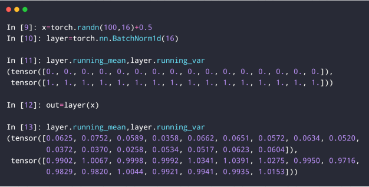

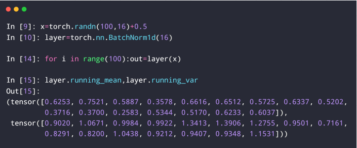

`running_mean` 就是上面的 $\mu$，`running_var` 就是 $\sigma$，每次 batch normalization 后，都会更新这两个属性

## 伪代码


## 查看参数

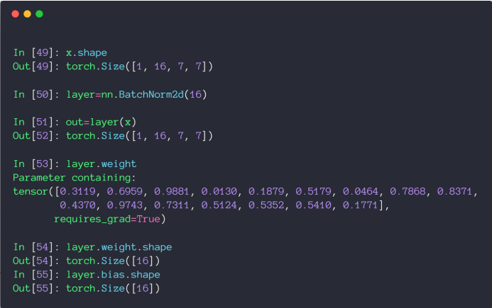

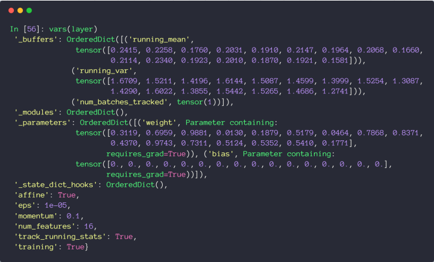

注意，在 Test 中，因为我们往往只会预测一个 Sample，所以统计 $\mu$ 和 $\sigma$ 就是没有意义的。

所以在 Test 时，会把全局的 `running_mean` 和 `running_var` 赋值给 $\mu$ 和 $\sigma$，同时，在 Test 时，也没有 Backward，所以 $\beta$ 和 $\gamma$ 是不需要更新的，所以在 Test 时，需要调用 `eval()` 方法将模式切换过来再送入 Sample 进行预测。

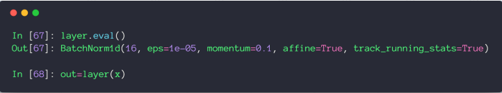

## 使用 Batch Normalization 的优点

* 收敛速度更快
* 更好的最优解
* 更稳定


# 经典卷积网络

## LeNet

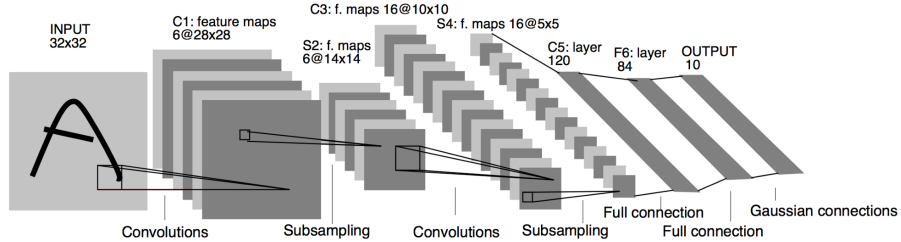

## AlexNet

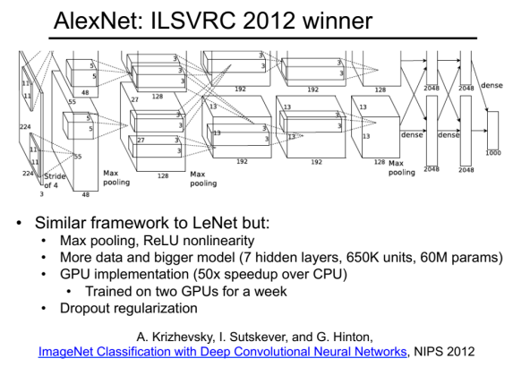

## VGGNet


## GoogLeNet

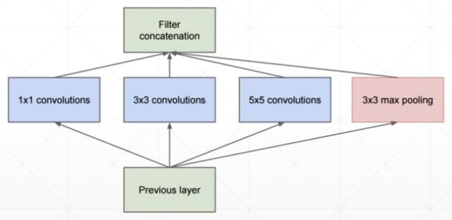

## ResNet

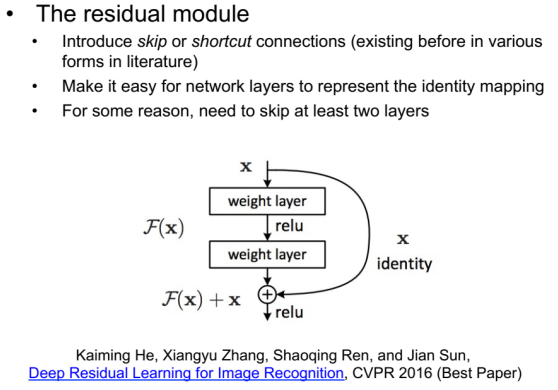

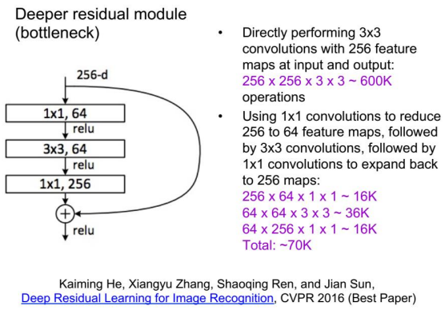

### 代码示例

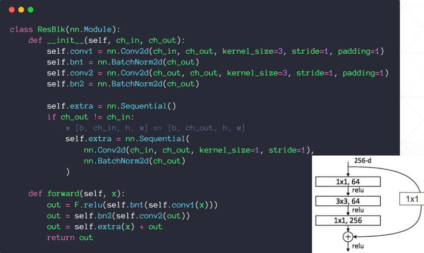

```python
import  torch
from    torch import  nn
from    torch.nn import functional as F
from    torch.utils.data import DataLoader
from    torchvision import datasets
from    torchvision import transforms
from    torch import nn, optim

# from    torchvision.models import resnet18

class ResBlk(nn.Module):
    """
    resnet block
    """

    def __init__(self, ch_in, ch_out):
        """
        :param ch_in:
        :param ch_out:
        """
        super(ResBlk, self).__init__()

        self.conv1 = nn.Conv2d(ch_in, ch_out, kernel_size=3, stride=1, padding=1)
        self.bn1 = nn.BatchNorm2d(ch_out)
        self.conv2 = nn.Conv2d(ch_out, ch_out, kernel_size=3, stride=1, padding=1)
        self.bn2 = nn.BatchNorm2d(ch_out)

        self.extra = nn.Sequential()
        if ch_out != ch_in:
            # [b, ch_in, h, w] => [b, ch_out, h, w]
            self.extra = nn.Sequential(
                nn.Conv2d(ch_in, ch_out, kernel_size=1, stride=1),
                nn.BatchNorm2d(ch_out)
            )

    def forward(self, x):
        """
        :param x: [b, ch, h, w]
        :return:
        """
        out = F.relu(self.bn1(self.conv1(x)))
        out = self.bn2(self.conv2(out))
        # short cut.
        # extra module: [b, ch_in, h, w] => [b, ch_out, h, w]
        # element-wise add:
        out = self.extra(x) + out

        return out

class ResNet18(nn.Module):

    def __init__(self):
        super(ResNet18, self).__init__()

        self.conv1 = nn.Sequential(
            nn.Conv2d(3, 16, kernel_size=3, stride=1, padding=1),
            nn.BatchNorm2d(16)
        )
        # followed 4 blocks
        # [b, 64, h, w] => [b, 128, h ,w]
        self.blk1 = ResBlk(16, 16)
        # [b, 128, h, w] => [b, 256, h, w]
        self.blk2 = ResBlk(16, 32)
        # # [b, 256, h, w] => [b, 512, h, w]
        # self.blk3 = ResBlk(128, 256)
        # # [b, 512, h, w] => [b, 1024, h, w]
        # self.blk4 = ResBlk(256, 512)

        self.outlayer = nn.Linear(32*32*32, 10)

    def forward(self, x):
        """
        :param x:
        :return:
        """
        x = F.relu(self.conv1(x))

        # [b, 64, h, w] => [b, 1024, h, w]
        x = self.blk1(x)
        x = self.blk2(x)
        # x = self.blk3(x)
        # x = self.blk4(x)

        # print(x.shape)
        x = x.view(x.size(0), -1)
        x = self.outlayer(x)

        return x

def main():
    batchsz = 32

    cifar_train = datasets.CIFAR10('cifar', True, transform=transforms.Compose([
        transforms.Resize((32, 32)),
        transforms.ToTensor()
    ]), download=True)
    cifar_train = DataLoader(cifar_train, batch_size=batchsz, shuffle=True)

    cifar_test = datasets.CIFAR10('cifar', False, transform=transforms.Compose([
        transforms.Resize((32, 32)),
        transforms.ToTensor()
    ]), download=True)
    cifar_test = DataLoader(cifar_test, batch_size=batchsz, shuffle=True)


    x, label = iter(cifar_train).next()
    print('x:', x.shape, 'label:', label.shape)

    device = torch.device('cuda')
    # model = Lenet5().to(device)
    model = ResNet18().to(device)

    criteon = nn.CrossEntropyLoss().to(device)
    optimizer = optim.Adam(model.parameters(), lr=1e-3)
    print(model)

    for epoch in range(1000):

        model.train()
        for batchidx, (x, label) in enumerate(cifar_train):
            # [b, 3, 32, 32]
            # [b]
            x, label = x.to(device), label.to(device)

            logits = model(x)
            # logits: [b, 10]
            # label:  [b]
            # loss: tensor scalar
            loss = criteon(logits, label)

            # backprop
            optimizer.zero_grad()
            loss.backward()
            optimizer.step()
        #
        print(epoch, 'loss:', loss.item())

        model.eval()
        with torch.no_grad():
            # test
            total_correct = 0
            total_num = 0
            for x, label in cifar_test:
                # [b, 3, 32, 32]
                # [b]
                x, label = x.to(device), label.to(device)

                # [b, 10]
                logits = model(x)
                # [b]
                pred = logits.argmax(dim=1)
                # [b] vs [b] => scalar tensor
                correct = torch.eq(pred, label).float().sum().item()
                total_correct += correct
                total_num += x.size(0)
                # print(correct)

            acc = total_correct / total_num
            print(epoch, 'acc:', acc)

if __name__ == '__main__':
    main()
```

# nn.Module 相关 API

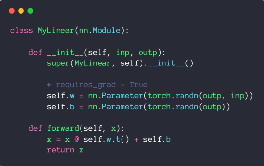

### 优点1 Container

可以直接加入 nn.Sequential

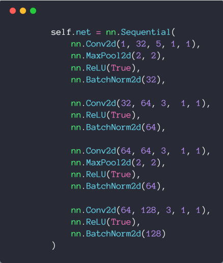

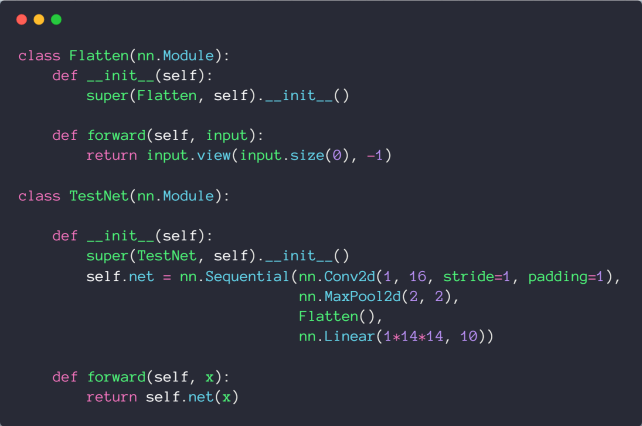

### 优点2 可以方便的查看参数

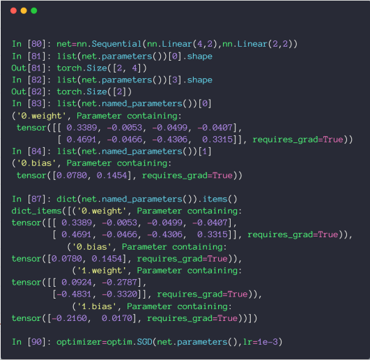

### 优点3 可以方便的查看所有节点

* modules: all nodes
* children: direct children

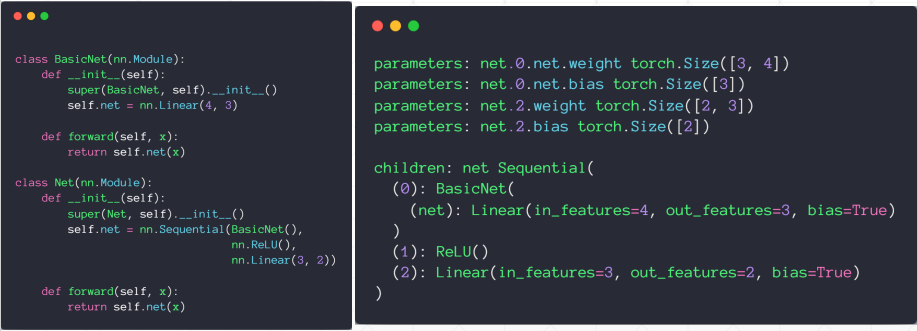

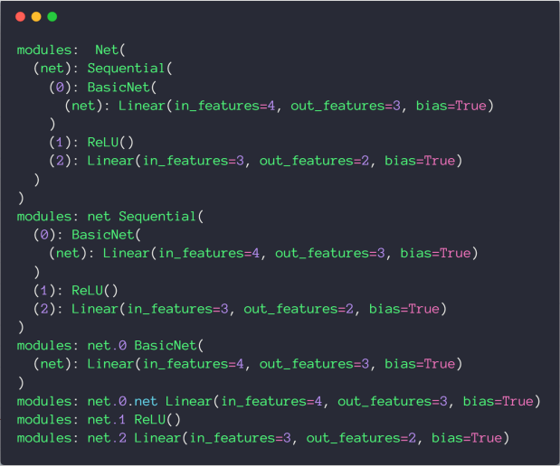

### 优点4 可以方便的转移到 GPU 设备上

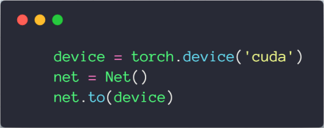

### 优点5 保存和加载模型

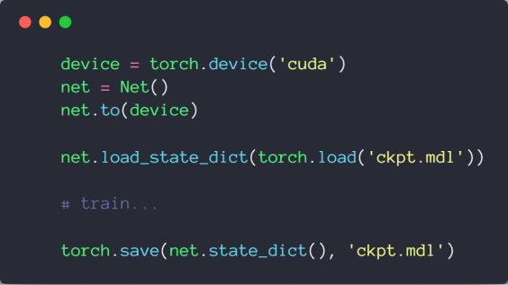

### 优点6 方便的在训练和测试之间切换

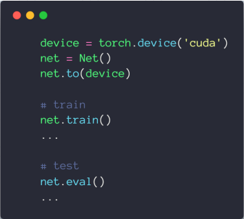

## 代码示例

```python
import  torch
from    torch import nn
from    torch import optim

class MyLinear(nn.Module):

    def __init__(self, inp, outp):
        super(MyLinear, self).__init__()

        # requires_grad = True
        self.w = nn.Parameter(torch.randn(outp, inp))
        self.b = nn.Parameter(torch.randn(outp))

    def forward(self, x):
        x = x @ self.w.t() + self.b
        return x

class Flatten(nn.Module):

    def __init__(self):
        super(Flatten, self).__init__()

    def forward(self, input):
        return input.view(input.size(0), -1)

class TestNet(nn.Module):

    def __init__(self):
        super(TestNet, self).__init__()

        self.net = nn.Sequential(nn.Conv2d(1, 16, stride=1, padding=1),
                                 nn.MaxPool2d(2, 2),
                                 Flatten(),
                                 nn.Linear(1*14*14, 10))

    def forward(self, x):
        return self.net(x)

class BasicNet(nn.Module):

    def __init__(self):
        super(BasicNet, self).__init__()

        self.net = nn.Linear(4, 3)

    def forward(self, x):
        return self.net(x)

class Net(nn.Module):

    def __init__(self):
        super(Net, self).__init__()

        self.net = nn.Sequential(BasicNet(),
                                 nn.ReLU(),
                                 nn.Linear(3, 2))
    def forward(self, x):
        return self.net(x)

def main():
    device = torch.device('cuda')
    net = Net()
    net.to(device)

    net.train()

    net.eval()

    # net.load_state_dict(torch.load('ckpt.mdl'))
    #
    #
    # torch.save(net.state_dict(), 'ckpt.mdl')

    for name, t in net.named_parameters():
        print('parameters:', name, t.shape)

    for name, m in net.named_children():
        print('children:', name, m)


    for name, m in net.named_modules():
        print('modules:', name, m)

if __name__ == '__main__':
    main()
```


# 数据增强

## 翻转

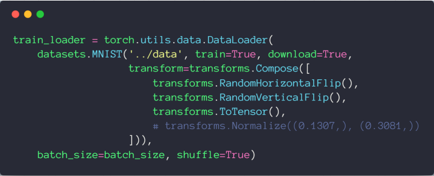

## 旋转

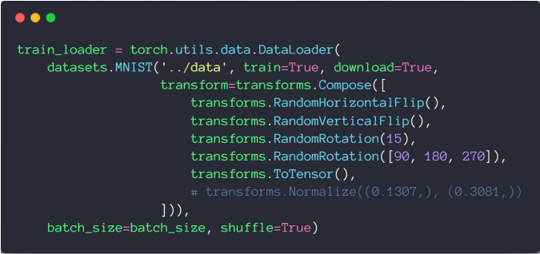

## 缩放和裁剪

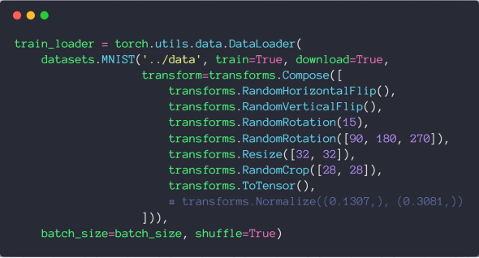

## 代码示例

```python
import  torch
import  torch.nn as nn
import  torch.nn.functional as F
import  torch.optim as optim
from    torchvision import datasets, transforms

from visdom import Visdom

batch_size=200
learning_rate=0.01
epochs=10

train_loader = torch.utils.data.DataLoader(
    datasets.MNIST('../data', train=True, download=True,
                   transform=transforms.Compose([
                       transforms.RandomHorizontalFlip(),
                       transforms.RandomVerticalFlip(),
                       transforms.RandomRotation(15),
                       transforms.RandomRotation([90, 180, 270]),
                       transforms.Resize([32, 32]),
                       transforms.RandomCrop([28, 28]),
                       transforms.ToTensor(),
                       # transforms.Normalize((0.1307,), (0.3081,))
                   ])),
    batch_size=batch_size, shuffle=True)
test_loader = torch.utils.data.DataLoader(
    datasets.MNIST('../data', train=False, transform=transforms.Compose([
        transforms.ToTensor(),
        # transforms.Normalize((0.1307,), (0.3081,))
    ])),
    batch_size=batch_size, shuffle=True)

class MLP(nn.Module):

    def __init__(self):
        super(MLP, self).__init__()

        self.model = nn.Sequential(
            nn.Linear(784, 200),
            nn.LeakyReLU(inplace=True),
            nn.Linear(200, 200),
            nn.LeakyReLU(inplace=True),
            nn.Linear(200, 10),
            nn.LeakyReLU(inplace=True),
        )

    def forward(self, x):
        x = self.model(x)

        return x

device = torch.device('cuda:0')
net = MLP().to(device)
optimizer = optim.SGD(net.parameters(), lr=learning_rate)
criteon = nn.CrossEntropyLoss().to(device)

viz = Visdom()

viz.line([0.], [0.], win='train_loss', opts=dict(title='train loss'))
viz.line([[0.0, 0.0]], [0.], win='test', opts=dict(title='test loss&acc.',
                                                   legend=['loss', 'acc.']))
global_step = 0

for epoch in range(epochs):

    for batch_idx, (data, target) in enumerate(train_loader):
        data = data.view(-1, 28*28)
        data, target = data.to(device), target.cuda()

        logits = net(data)
        loss = criteon(logits, target)

        optimizer.zero_grad()
        loss.backward()
        # print(w1.grad.norm(), w2.grad.norm())
        optimizer.step()

        global_step += 1
        viz.line([loss.item()], [global_step], win='train_loss', update='append')

        if batch_idx % 100 == 0:
            print('Train Epoch: {} [{}/{} ({:.0f}%)]\tLoss: {:.6f}'.format(
                epoch, batch_idx * len(data), len(train_loader.dataset),
                       100. * batch_idx / len(train_loader), loss.item()))


    test_loss = 0
    correct = 0
    for data, target in test_loader:
        data = data.view(-1, 28 * 28)
        data, target = data.to(device), target.cuda()
        logits = net(data)
        test_loss += criteon(logits, target).item()

        pred = logits.argmax(dim=1)
        correct += pred.eq(target).float().sum().item()

    viz.line([[test_loss, correct / len(test_loader.dataset)]],
             [global_step], win='test', update='append')
    viz.images(data.view(-1, 1, 28, 28), win='x')
    viz.text(str(pred.detach().cpu().numpy()), win='pred',
             opts=dict(title='pred'))

    test_loss /= len(test_loader.dataset)
    print('\nTest set: Average loss: {:.4f}, Accuracy: {}/{} ({:.0f}%)\n'.format(
        test_loss, correct, len(test_loader.dataset),
        100. * correct / len(test_loader.dataset)))

```
