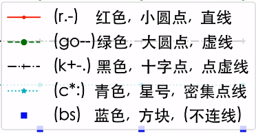

> B 站视频：[《十分钟讲解 Matplotlib 的核心内容与基本逻辑》](https://www.bilibili.com/video/BV1Pe4y1R79d/)
>
> [Matplotlib_examples.ipynb](assets/Matplotlib_examples-20230720030616-zvqxlv2.ipynb)
>
> [Matplotlib_examples.html](assets/Matplotlib_examples-20230720030958-9pr1r14.html)


## 入门

### 基本设置

```python
import matplotlib.pyplot as plt
import numpy as np

# 一些基本设置
# 设置支持中文字体（黑体）
matplotlib.rcParams['font.family'] = ['SimHei']
matplotlib.rcParams['axes.unicode_minus'] = False
# 设置图片清晰度（200dpi: 200像素每英寸）
matplotlib.rcParams['figure.dpi'] = 200
# 图画面板调整为白色
matplotlib.rcParams['axes.facecolor']='white'
matplotlib.rcParams['savefig.facecolor']='white'

x = [1, 2, 3, 4]
y1 = [4, 8, 2, 6]
y2 = [10, 12, 5, 3]

plt.plot(x, y1)
plt.plot(x, y2)
plt.show()
```

### 设置标签

```python
plt.plot(x, y1, "ro--", label='abc')
plt.plot(x, y2, "bs", label='def')

plt.title('sample')
plt.xlabel('time')
plt.ylabel('price')
plt.legend()
```

### 设置 x 轴和 y 轴范围

```python
plt.xticks([1, 2, 3, 4])
plt.yticks(np.arange(2, 13, 1))
plt.grid()
```

### 局部显示

```python
plt.xlim(2.5, 4.5)
plt.ylim(1.5, 6.5)
```

### 更多线段格式



更多格式参考：[https://matplotlib.org/stable/api/_as_gen/matplotlib.pyplot.plot.html](https://matplotlib.org/stable/api/_as_gen/matplotlib.pyplot.plot.html)

### 更多图片样式

[https://matplotlib.org/stable/plot_types/index.html](https://matplotlib.org/stable/plot_types/index.html)

## 结构


### 画两张图

```python
plt.figure(figsize=(10, 6))

plt.subplot(211)
plt.bar(x, y1)

plt.subplot(212)
plt.plot(x, y2, "b^--")

plt.show()
```

### 使用面向对象 OOP 精准语法

```python
fig, axes = plt.subplots(2, 1, figsize=(6, 6))

axes[0].bar(x, y1)
axes[1].plot(x, y2, "b^--")
```

### 画多个图

```python
fig, axes = plt.subplots(2, 2, figsize=(6, 6))

axes[0, 0].bar(x, y1)
axes[0, 1].plot(x, y2, "b^--")
ax = axes[1, 0]
ax.scatter(x, np.array(y2) - np.array(y1),
           s=[10, 20, 50, 100], # 大小
           c=["r", "b", "c", "y"], # 颜色
           ) 
axes[0, 0].set_title("Bar")
axes[0, 1].set_title("Plot")
ax.set_ylabel("y2-y1")
```

### 更多设置

```python
fig, axes = plt.subplots(2, 2, figsize=(6, 6),
                         facecolor="lightblue", # 背景色
                         sharex=True, # 共享x轴
                         sharey=True, # 共享y轴
                         )
axes[1, 1].remove() # 删除子图
axes[0, 0].plot(x, y1, "r+-")

# Figure对象添加整体大标题/注释
fig.suptitle("Four Subplots")
fig.supylabel("y1")
fig.supxlabel("x")
```

### 画 3D 图

```python
# 重新添加右下角坐标系（改变为三维坐标系）
ax = fig.add_subplot(2, 2, 4, 
                     projection='3d', facecolor="grey")
ax.stem(seasons, stock1, stock2-stock1)
ax.stem(seasons, stock1, stock2-stock1, 
        linefmt='k--', basefmt='k--', 
        bottom=10, orientation='y')
ax.plot_surface(np.array([1,1,4,4]).reshape(2,2),
                np.array([2.5,10,2.5,10]).reshape(2,2),
                np.array([0]*4).reshape(2,2), 
                alpha=0.2, color='red')
ax.plot_surface(np.array([1,1,4,4]).reshape(2,2),
                np.array([10]*4).reshape(2,2),
                np.array([-2.5,8,-2.5,8]).reshape(2,2),
                alpha=0.2, color='black')
ax.set_xlabel("季度(x)")
ax.set_ylabel("股票1(y)")
ax.set_zlabel("差价(z)")
```

### 补充设置

```python
# 改变坐标系的背景颜色（在画图后改变属性，OOP）
axes[1, 0].set_facecolor('grey')
axes[1, 0].patch.set_alpha(0.2)
axes[0, 0].set_facecolor('red')
axes[0, 0].patch.set_alpha(0.2)
plt.tight_layout()
```

## 常用工作流程

### 导入包

```python
# 步骤 1. 导入包
import matplotlib.pyplot as plt
import matplotlib as mpl  # 整个包
import numpy as np
```

### 查询所有画图整体风格

```python
# 步骤 2. 查询所有画图整体风格
# print(plt.style.available)
plt.style.use('default')  # 默认风格
plt.plot(np.random.randn(50))
plt.title("default style")
# plt.savefig("images/style_1.png", facecolor=plt.gcf().get_facecolor())
plt.show()

plt.style.use('ggplot')
plt.plot(np.random.randn(50))
plt.title("ggplot style")
# plt.savefig("images/style_2.png", facecolor=plt.gcf().get_facecolor())
plt.show()

plt.style.use('seaborn-dark')
plt.plot(np.random.randn(50))
plt.title("seaborn-dark")
# plt.gcf().savefig("images/style_3.png", facecolor=plt.gcf().get_facecolor())
plt.show()
plt.style.use('default')  # 重新设置回默认风格
```

### 查询当前的一些画图属性设置

```python
# 查询当前的一些画图属性设置
print(mpl.rcParams.get('figure.figsize'))  # 当前图画大小（长*高）（英寸）
print(mpl.rcParams.get('font.size'))  # 当前字体大小
```

### 查询当前计算机中 matplotlib 的可用字体

```python
# 例子：查询当前你的计算机中matplotlib的可用字体
import matplotlib.font_manager as fm

fm._load_fontmanager(try_read_cache=False)
fpaths = fm.findSystemFonts(fontpaths=None)
# print(fpaths)
exempt_lst = ["NISC18030.ttf", "Emoji"]
skip=False
for i in fpaths:
    # print(i)
    for ft in exempt_lst:
        if ft in i:
            skip=True
    if skip==True:
        skip=False
        continue
    f = matplotlib.font_manager.get_font(i)
    print(f.family_name)
```

### 一些常用设定参数

```python
import matplotlib as mpl
# step 2. 一些常用设定参数
# 设置字体(主要字体/数学公式字符集)
rc = {"font.family" : "Times New Roman",  # 默认字体
      "mathtext.fontset" : "stix",  # 数学字符集
      }
mpl.rcParams.update(rc) # 根据dict一次性更新很多参数
# 设置图片清晰度（300dpi）
mpl.rcParams['figure.dpi'] = 300
# 图画面板调整为白色
mpl.rcParams['axes.facecolor'] = 'white'
mpl.rcParams['savefig.facecolor'] = 'white'
# Figure自动调整格式
plt.rcParams['figure.constrained_layout.use'] = True
```

### 中英文/数学符号混排

```python
# 例子. 中英文/数学符号混排
fig, ax = plt.subplots()
# 单独添加字体
st_font = fm.FontProperties(fname="/System/Library/Fonts/Supplemental/Songti.ttc")
# 注(理论上): SC: 简体中文; TC: 繁体中文;
# 实际上一般应该是使用Heiti TC即可（所见即所得）
ax.set_xlabel(r'乌龟烏龜/密度$\mathrm{kg/m}^3$',
              fontname = 'Heiti TC', fontsize=20)  # 单独指定字体大小与格式
ax.text(0.2, 0.8, r'乌龟烏龜/黑体 $\mathrm{Times New Roman}$',
        fontname='Heiti TC', fontsize=20)
# 目前其他字体支持也比较有限。。。如这里宋体没有繁体
ax.text(0.2, 0.6, r'乌龟烏龜/宋体 $Times New Roman$', 
        fontproperties=st_font, fontsize=30)
plt.ylim(0.5, 0.9)

# plt.savefig("images/pic3_1.png", facecolor=fig.get_facecolor())
plt.show()
```

## 复用代码/函数

```python
# 三个“三角函数”
x = np.linspace(0, 10, 100)
y1 = np.cos(x)
y2 = np.sin(x)
y3 = np.tanh(x) # tanh函数

# 画时间序列曲线
# 输入/输出都包含坐标轴变量
def plot_time_series(x, y, fmt, lab="", ax=None):
    if ax is None:
        fig, ax = plt.subplot()
    ax.plot(x, y, fmt, label=lab)
    # x轴固有格式
    ax.set_xlabel("time")
    ax.xaxis.set_major_locator(plt.MultipleLocator(np.pi / 2))
    ax.xaxis.set_minor_locator(plt.MultipleLocator(np.pi / 4))
    labs = ax.xaxis.get_ticklabels()
    ax.xaxis.set_ticklabels([r"{:.2f}$\pi$".format(i/2) for i, l in enumerate(labs)])
    return ax

# 两个坐标周
fig, axes = plt.subplots(2, 1, figsize=(6, 3),
                         sharex=True, facecolor="white")
# 在第一个坐标周画两条线
plot_time_series(x, y1, 'b-', r'$y=sin(x)$', ax=axes[0])
plot_time_series(x, y2, 'r:', r'$y=cos(x)$', ax=axes[0])
# 在第二个坐标周画一条线
plot_time_series(x, y3, 'g--', ax=axes[1])

# plt.savefig("images/pic3_2.png", facecolor=fig.get_facecolor())
plt.show()
```

### 很多格式可以后期再函数外处理

```python
# 拓展：很多格式可以后期再函数外处理
def plot_time_series(x, y, fmt, lab="", ax=None):
    if ax is None:
        fig, ax = plt.subplot()
    ax.plot(x, y, fmt, label=lab)
    # x轴固有格式
    ax.set_xlabel("time")
    ax.xaxis.set_major_locator(plt.MultipleLocator(np.pi / 2))
    ax.xaxis.set_minor_locator(plt.MultipleLocator(np.pi / 4))
    labs = ax.xaxis.get_ticklabels()
    ax.xaxis.set_ticklabels([r"{:.2f}$\pi$".format(i/2) for i, l in enumerate(labs)])
    return ax

fig, axes = plt.subplots(2, 1, figsize=(6, 3), 
                         sharex=True, facecolor="white")
plot_time_series(x, y1, 'b-', r'$y=sin(x)$', axes[0])
plot_time_series(x, y2, 'r:', r'$y=cos(x)$', axes[0])
plot_time_series(x, y3, 'g--', ax=axes[1])

# 后期调整格式/添加内容/美化...
axes[0].set_xlabel("")
axes[0].legend(loc="upper right")
axes[1].legend(loc="upper right")
axes[0].grid()
axes[1].grid()

# plt.savefig("images/pic3_3.png", facecolor=fig.get_facecolor())
plt.show()
```

### 后期调整

```python
# 后期调整
fig, axes = plt.subplots(2, 1, figsize=(6, 3),
                         sharex=True, facecolor="white")
plot_time_series(x, y1, 'b-', r'$y=sin(x)$', axes[0])
plot_time_series(x, y2, 'r:', r'$y=cos(x)$', axes[0])
plot_time_series(x, y3, 'g--', ax=axes[1])
# 调整格式/添加内容/美化...
axes[0].set_xlabel("")
# 补充图示
axes[1].lines[0].set_label(r"$y=tanh(x)$")
axes[0].legend(loc="upper right")
axes[1].legend(loc="upper right")
axes[0].grid()
axes[1].grid()

plt.savefig("images/pic3_4.png", facecolor=fig.get_facecolor())
plt.show()
```

## 交互式画图

```python
import matplotlib.pyplot as plt
from matplotlib import cm
from matplotlib.ticker import LinearLocator
import numpy as np
```

```python
%matplotlib widget

# 交互式画图

fig, ax = plt.subplots(subplot_kw={"projection": "3d"})
# Make data.
X = np.arange(-5, 5, 0.25)
Y = np.arange(-5, 5, 0.25)
X, Y = np.meshgrid(X, Y)
R = np.sqrt(X**2 + Y**2)
Z = np.sin(R)

# Plot the surface.
surf = ax.plot_surface(X, Y, Z, cmap=cm.coolwarm,
                       linewidth=0, antialiased=False)

# Customize the z axis.
ax.set_zlim(-1.01, 1.01)
ax.zaxis.set_major_locator(LinearLocator(10))
# A StrMethodFormatter is used automatically
ax.zaxis.set_major_formatter('{x:.02f}')

# Add a color bar which maps values to colors.
fig.colorbar(surf, shrink=0.5, aspect=5)

# plt.savefig("images/pic3_5.png", facecolor=fig.get_facecolor())
plt.show()
```
