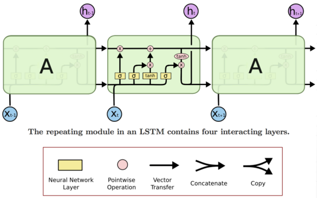
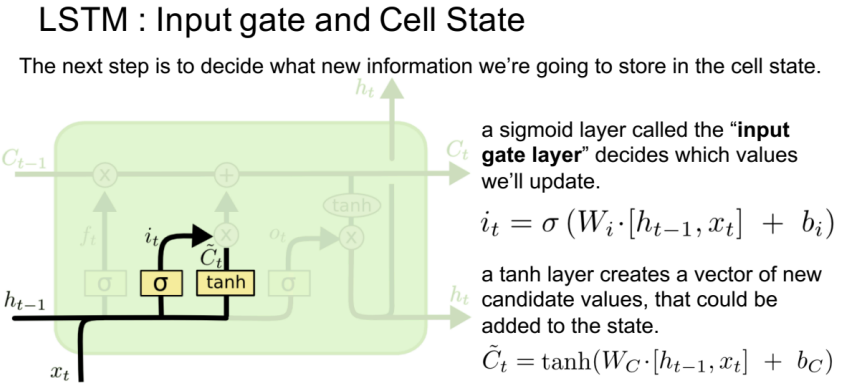
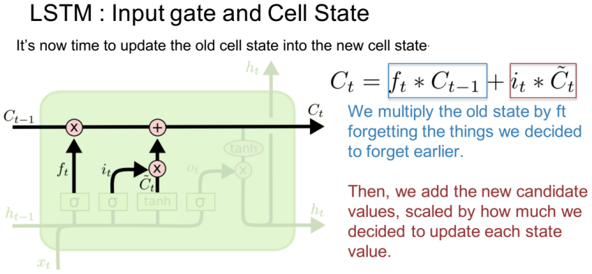
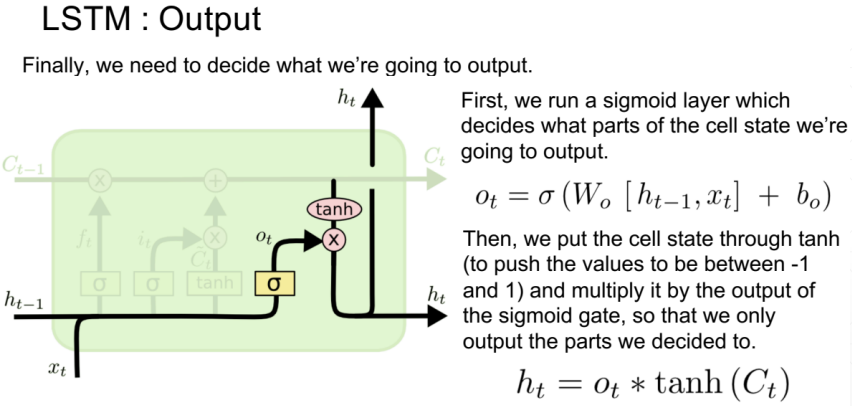
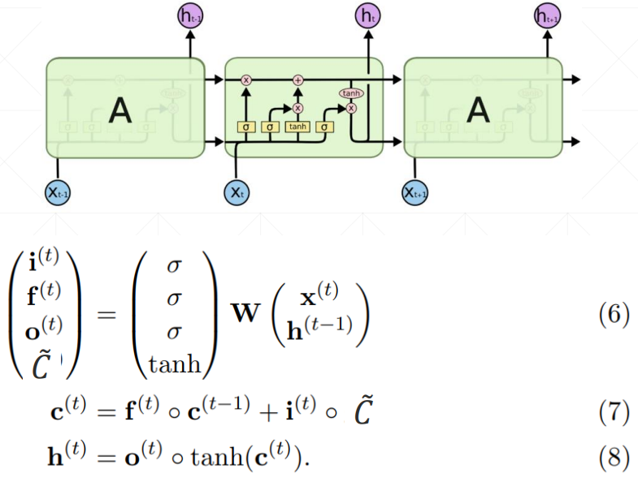
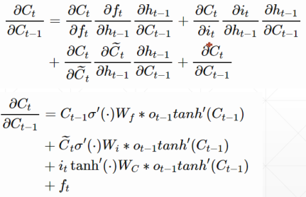
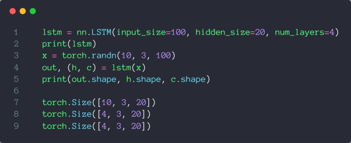

最为关键的点就在于 LSTM 有三个门，遗忘门（forget gate）、输入门（input gate）和输出门（output gate），每个门通过 sigmoid 激活函数（σ）输出 0 或者 1，然后通过 element-wise 的乘积操作，达到筛选信息的目的。



## 遗忘门


选择性的筛选上一步的记忆信息 $C_{t-1}$，所以叫做遗忘门

## 输入门



将 $h_{t-1}$ 和 $x_{t}$ 的经过 Sigmoid 激活函数得到输入门，同时，$h_{t-1}$ 和 $x_{t}$ 经过 tanh 激活函数得到新的记忆信息，然后和输入门经过 element-wise 的乘积操作，将输入进行选择性的筛选，所以叫做输入门



接下来就是更新上一步的记忆信息 $C_{t-1}$，通过 element-wise 的相加操作

从这里也可以看出输入门和输出门的状态组合会导致不同的结果

|input gate|forget gate|behavior|
| :----------: | :-----------: | :---------------------------: |
|0|1|remember the previous value|
|1|1|add to the previous value|
|0|0|erase the value|
|1|0|overwrite the value|

## 输出门



## 总体结构图



## 梯度信息

RNN 网络中会有梯度弥散的情况发生，根本原因就是 $W_R$ 的连乘，而 LSTM 就很好的解决了这个问题



## 相关 API

> 参考：[LSTM使用.pdf](assets/52-20230801004608-a4q3xgt.pdf)



## 情感分类实战

> 参考：[情感分类实战.pdf](assets/53-20230801004921-1as17pj.pdf)

```python
# -*- coding: utf-8 -*-
"""lstm

Automatically generated by Colaboratory.

Original file is located at
    https://colab.research.google.com/drive/1GX0Rqur8T45MSYhLU9MYWAbycfLH4-Fu
"""

!pip install torch
!pip install torchtext
!python -m spacy download en

# K80 gpu for 12 hours
import torch
from torch import nn, optim
from torchtext import data, datasets

print('GPU:', torch.cuda.is_available())

torch.manual_seed(123)

TEXT = data.Field(tokenize='spacy')
LABEL = data.LabelField(dtype=torch.float)
train_data, test_data = datasets.IMDB.splits(TEXT, LABEL)

print('len of train data:', len(train_data))
print('len of test data:', len(test_data))

print(train_data.examples[15].text)
print(train_data.examples[15].label)

# word2vec, glove
TEXT.build_vocab(train_data, max_size=10000, vectors='glove.6B.100d')
LABEL.build_vocab(train_data)


batchsz = 30
device = torch.device('cuda')
train_iterator, test_iterator = data.BucketIterator.splits(
    (train_data, test_data),
    batch_size = batchsz,
    device=device
)

class RNN(nn.Module):
  
    def __init__(self, vocab_size, embedding_dim, hidden_dim):
        """
        """
        super(RNN, self).__init__()
    
        # [0-10001] => [100]
        self.embedding = nn.Embedding(vocab_size, embedding_dim)
        # [100] => [256]
        self.rnn = nn.LSTM(embedding_dim, hidden_dim, num_layers=2, 
                           bidirectional=True, dropout=0.5)
        # [256*2] => [1]
        self.fc = nn.Linear(hidden_dim*2, 1)
        self.dropout = nn.Dropout(0.5)
    
    
    def forward(self, x):
        """
        x: [seq_len, b] vs [b, 3, 28, 28]
        """
        # [seq, b, 1] => [seq, b, 100]
        embedding = self.dropout(self.embedding(x))
    
        # output: [seq, b, hid_dim*2]
        # hidden/h: [num_layers*2, b, hid_dim]
        # cell/c: [num_layers*2, b, hid_di]
        output, (hidden, cell) = self.rnn(embedding)
    
        # [num_layers*2, b, hid_dim] => 2 of [b, hid_dim] => [b, hid_dim*2]
        hidden = torch.cat([hidden[-2], hidden[-1]], dim=1)
    
        # [b, hid_dim*2] => [b, 1]
        hidden = self.dropout(hidden)
        out = self.fc(hidden)
    
        return out

rnn = RNN(len(TEXT.vocab), 100, 256)

pretrained_embedding = TEXT.vocab.vectors
print('pretrained_embedding:', pretrained_embedding.shape)
rnn.embedding.weight.data.copy_(pretrained_embedding)
print('embedding layer inited.')

optimizer = optim.Adam(rnn.parameters(), lr=1e-3)
criteon = nn.BCEWithLogitsLoss().to(device)
rnn.to(device)

import numpy as np

def binary_acc(preds, y):
    """
    get accuracy
    """
    preds = torch.round(torch.sigmoid(preds))
    correct = torch.eq(preds, y).float()
    acc = correct.sum() / len(correct)
    return acc

def train(rnn, iterator, optimizer, criteon):
  
    avg_acc = []
    rnn.train()
  
    for i, batch in enumerate(iterator):
    
        # [seq, b] => [b, 1] => [b]
        pred = rnn(batch.text).squeeze(1)
        # 
        loss = criteon(pred, batch.label)
        acc = binary_acc(pred, batch.label).item()
        avg_acc.append(acc)
    
        optimizer.zero_grad()
        loss.backward()
        optimizer.step()
    
        if i%10 == 0:
            print(i, acc)
    
    avg_acc = np.array(avg_acc).mean()
    print('avg acc:', avg_acc)
  
  
def eval(rnn, iterator, criteon):
  
    avg_acc = []
  
    rnn.eval()
  
    with torch.no_grad():
        for batch in iterator:

            # [b, 1] => [b]
            pred = rnn(batch.text).squeeze(1)

            #
            loss = criteon(pred, batch.label)

            acc = binary_acc(pred, batch.label).item()
            avg_acc.append(acc)
    
    avg_acc = np.array(avg_acc).mean()
  
    print('>>test:', avg_acc)

for epoch in range(10):
  
    eval(rnn, test_iterator, criteon)
    train(rnn, train_iterator, optimizer, criteon)
```
