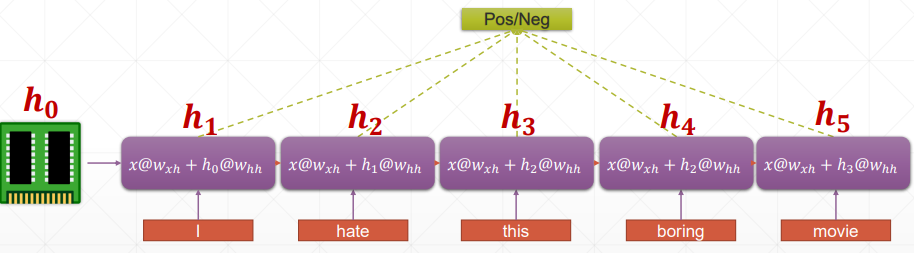
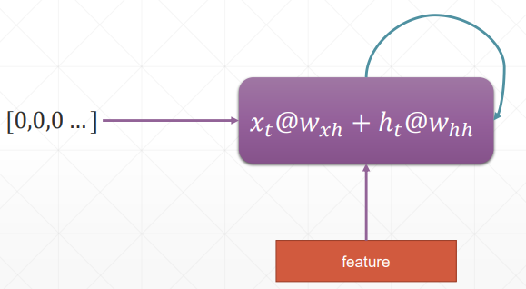
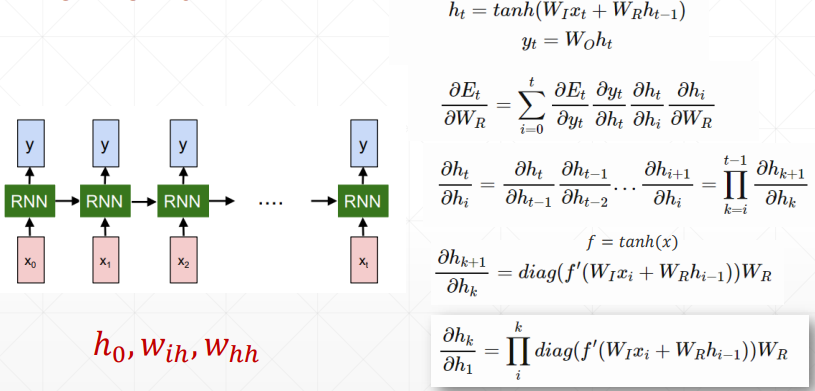
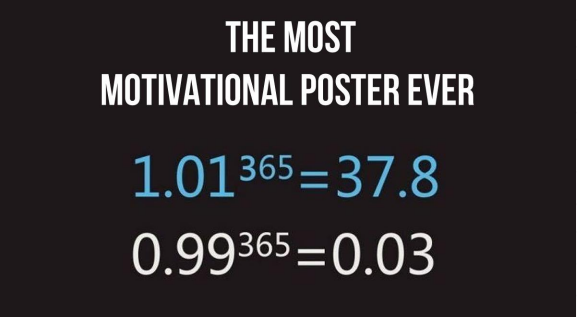
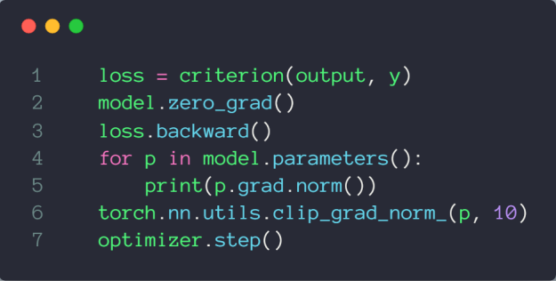
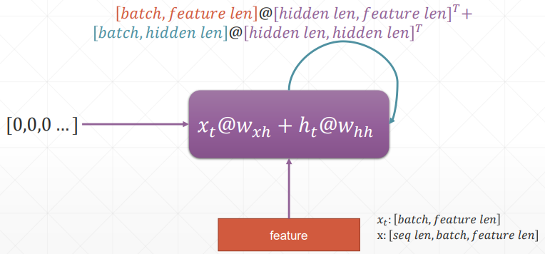
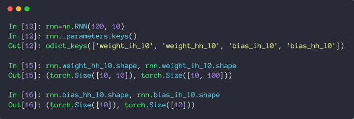

## 时间序列表示

通常表示为 [word num, batch, word vec]，即 [单词数，句子数，单词的特征维度数]

## 循环神经网络



h 表示连续的语义信息，为了减少参数量，所以 w 和 h 参数都是权重共享的




### 梯度更新



需要注意的是，$W_R$ 就是 $W_{hh}$，$W_{I}$ 就是 $W_{ih}$  

从梯度推导公式中可以看出，$\frac{\partial h_{k}}{\partial h_1}=\prod_{i}^{k}diag\left(f^{\prime}\left(W_{I}x_{i}+W_{R}h_{i-1}\right)\right)W_{R}$，里面包含了 $W_R$==== 的连乘，这就会导致梯度弥散和梯度爆炸==。

梯度爆炸可以尝试通过梯度裁剪解决，梯度弥散就需要靠 LSTM 网络啦





### 代码示例

> 参考：[RNN Layer使用.pdf](assets/48-20230731234645-88ob5ej.pdf)





```python
import  torch
from    torch import nn
from    torch import optim
from    torch.nn import functional as F

def main():

    rnn = nn.RNN(input_size=100, hidden_size=20, num_layers=1)
    print(rnn)
    x = torch.randn(10, 3, 100)
    out, h = rnn(x, torch.zeros(1, 3, 20))
    print(out.shape, h.shape)

    rnn = nn.RNN(input_size=100, hidden_size=20, num_layers=4)
    print(rnn)
    x = torch.randn(10, 3, 100)
    out, h = rnn(x, torch.zeros(4, 3, 20))
    print(out.shape, h.shape)
    # print(vars(rnn))

    print('rnn by cell')

    cell1 = nn.RNNCell(100, 20)
    h1 = torch.zeros(3, 20)
    for xt in x:
        h1 = cell1(xt, h1)
    print(h1.shape)


    cell1 = nn.RNNCell(100, 30)
    cell2 = nn.RNNCell(30, 20)
    h1 = torch.zeros(3, 30)
    h2 = torch.zeros(3, 20)
    for xt in x:
        h1 = cell1(xt, h1)
        h2 = cell2(h1, h2)
    print(h2.shape)

    print('Lstm')
    lstm = nn.LSTM(input_size=100, hidden_size=20, num_layers=4)
    print(lstm)
    x = torch.randn(10, 3, 100)
    out, (h, c) = lstm(x)
    print(out.shape, h.shape, c.shape)

    print('one layer lstm')
    cell = nn.LSTMCell(input_size=100, hidden_size=20)
    h = torch.zeros(3, 20)
    c = torch.zeros(3, 20)
    for xt in x:
        h, c = cell(xt, [h, c])
    print(h.shape, c.shape)


    print('two layer lstm')
    cell1 = nn.LSTMCell(input_size=100, hidden_size=30)
    cell2 = nn.LSTMCell(input_size=30, hidden_size=20)
    h1 = torch.zeros(3, 30)
    c1 = torch.zeros(3, 30)
    h2 = torch.zeros(3, 20)
    c2 = torch.zeros(3, 20)
    for xt in x:
        h1, c1 = cell1(xt, [h1, c1])
        h2, c2 = cell2(h1, [h2, c2])
    print(h2.shape, c2.shape)

if __name__ == '__main__':
    main()
```

### 时间序列预测实战

> 参考：[时间序列预测.pdf](assets/49-20230731234850-b3d49pr.pdf)

```python
import  numpy as np
import  torch
import  torch.nn as nn
import  torch.optim as optim
from    matplotlib import pyplot as plt

num_time_steps = 50
input_size = 1
hidden_size = 16
output_size = 1
lr=0.01

class Net(nn.Module):

    def __init__(self, ):
        super(Net, self).__init__()

        self.rnn = nn.RNN(
            input_size=input_size,
            hidden_size=hidden_size,
            num_layers=1,
            batch_first=True,
        )
        for p in self.rnn.parameters():
          nn.init.normal_(p, mean=0.0, std=0.001)

        self.linear = nn.Linear(hidden_size, output_size)

    def forward(self, x, hidden_prev):

       out, hidden_prev = self.rnn(x, hidden_prev)
       # [b, seq, h]
       out = out.view(-1, hidden_size)
       out = self.linear(out)
       out = out.unsqueeze(dim=0)
       return out, hidden_prev

model = Net()
criterion = nn.MSELoss()
optimizer = optim.Adam(model.parameters(), lr)

hidden_prev = torch.zeros(1, 1, hidden_size)

for iter in range(6000):
    start = np.random.randint(3, size=1)[0]
    time_steps = np.linspace(start, start + 10, num_time_steps)
    data = np.sin(time_steps)
    data = data.reshape(num_time_steps, 1)
    x = torch.tensor(data[:-1]).float().view(1, num_time_steps - 1, 1)
    y = torch.tensor(data[1:]).float().view(1, num_time_steps - 1, 1)

    output, hidden_prev = model(x, hidden_prev)
    hidden_prev = hidden_prev.detach()

    loss = criterion(output, y)
    model.zero_grad()
    loss.backward()
    # for p in model.parameters():
    #     print(p.grad.norm())
    # torch.nn.utils.clip_grad_norm_(p, 10)
    optimizer.step()

    if iter % 100 == 0:
        print("Iteration: {} loss {}".format(iter, loss.item()))

start = np.random.randint(3, size=1)[0]
time_steps = np.linspace(start, start + 10, num_time_steps)
data = np.sin(time_steps)
data = data.reshape(num_time_steps, 1)
x = torch.tensor(data[:-1]).float().view(1, num_time_steps - 1, 1)
y = torch.tensor(data[1:]).float().view(1, num_time_steps - 1, 1)

predictions = []
input = x[:, 0, :]
for _ in range(x.shape[1]):
  input = input.view(1, 1, 1)
  (pred, hidden_prev) = model(input, hidden_prev)
  input = pred
  predictions.append(pred.detach().numpy().ravel()[0])

x = x.data.numpy().ravel()
y = y.data.numpy()
plt.scatter(time_steps[:-1], x.ravel(), s=90)
plt.plot(time_steps[:-1], x.ravel())

plt.scatter(time_steps[1:], predictions)
plt.show()
```
