前面所接触的一般都是监督学习，而除了有监督学习，互联网上更多的数据都是没有标签的，所以这就引出了无监督学习。

无监督学习不是没有标签，而是数据本身就是标签，通过神经网络找出数据内在的特征，然后再重构出数据本身，这就是自编码器 Auto-Encoders

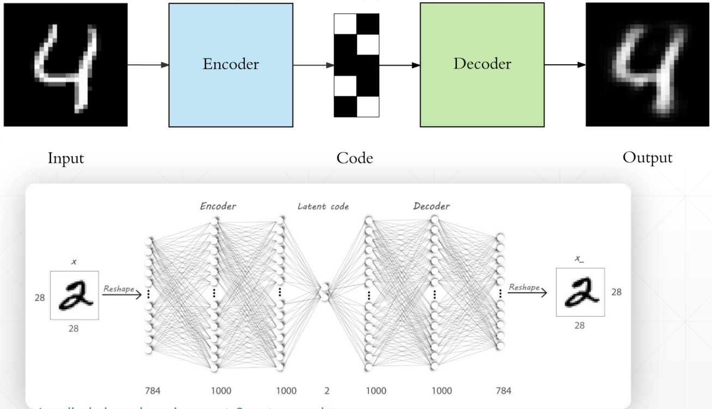

这个过程其实就是要找到数据本质的特征，和 PCA 降维类似，通过 Auto-Encoders 找到降维后的特征后，我们就可以方便的将其可视化出来了，比如这个比较著名的可视化网站：[Embedding projector - visualization of high-dimensional data (tensorflow.org)](https://projector.tensorflow.org/)

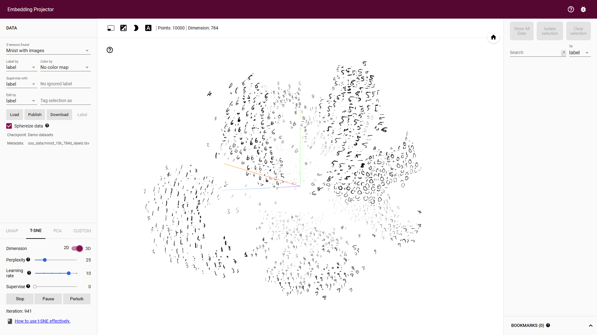

## PCA V.S. Auto-Encoders

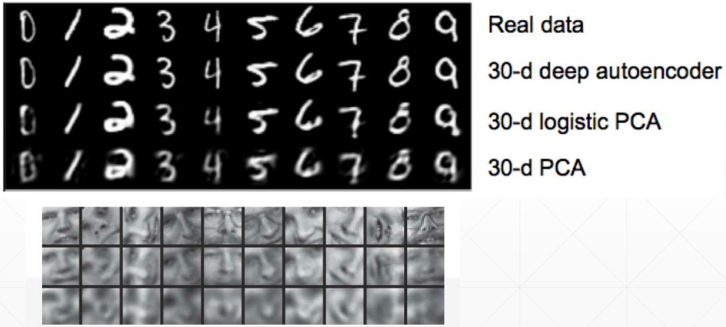

可以看到 Auto-Encoders 重建出来的数据效果还是明显优于 PCA 的

## Auto-Encoders 变种

### Denoising AutoEncoders

为了防止神经网络记住训练数据集，所以在训练数据中添加一个高斯噪声，逼迫神经网络真正学到数据的特征。

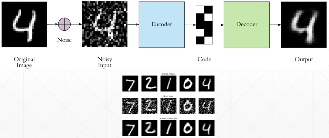

### Dropout AutoEncoders

同样也是为了防止过拟合，所以添加一个适当的 Dropout，可以提升测试集上的准确率，如最右边的图

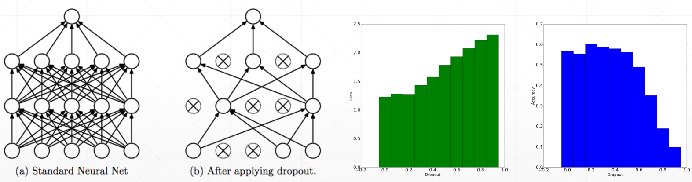

### Adversarial AutoEncoders

如果将隐藏层的数据分布可视化出来，可以发现它的分布是有偏的，如下

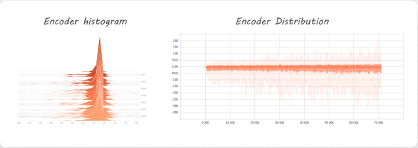

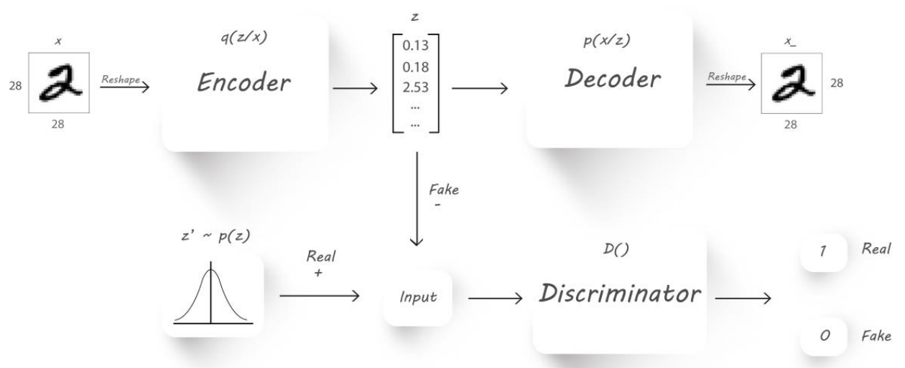

所以我们也想尽可能将这个分布也学习到，就借鉴 GAN 的思想，引入一个鉴别器，专门用来学习隐藏层的分布

## Variational AutoEncoders

> 相关资料：[Variational autoencoders. (jeremyjordan.me)](https://www.jeremyjordan.me/variational-autoencoders/)

KL 散度，用来衡量两个分布间的差异，详情：[Kullback-Leibler(KL)散度介绍](https://zhuanlan.zhihu.com/p/100676922)

所以和上面的 Adversarial AutoEncoders 类似，变分自编码器通过 KL 散度来学习隐藏层的分布，如下

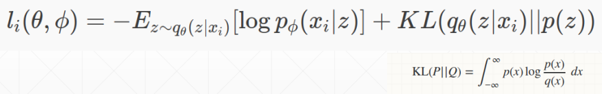

可以看到公式中被加号分为了两个部分，第一部分就是希望模型尽可能的学习到特征 z，然后通过特征 z 再重构出 x

第二部分就是 KL 散度的计算，KL 散度越小，表示两个分布之间的差异越小，所以第二部分就希望模型尽可能学习到特征的分布

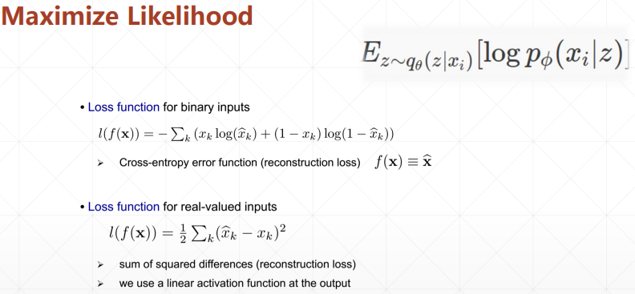

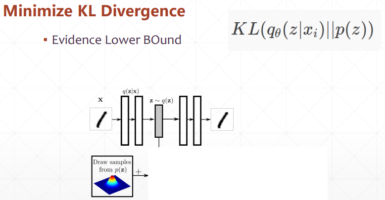

### KL 散度的计算

> 参考：[normal distribution - KL divergence between two univariate Gaussians - Cross Validated (stackexchange.com)](https://stats.stackexchange.com/questions/7440/kl-divergence-between-two-univariate-gaussians)

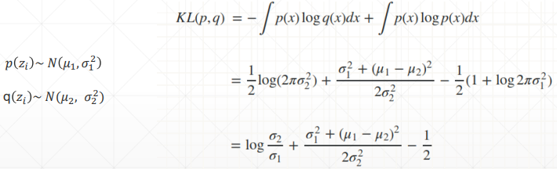

### Reparameterization trick

因为现在隐藏层变成了一个分布，所以需要从分布中进行取样，但取样又会造成无法求梯度的问题，也就是无法反向传播，所以，使用一个小 trick，如下

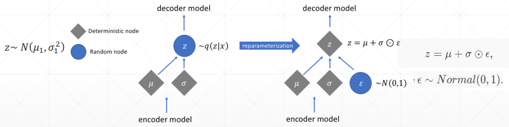

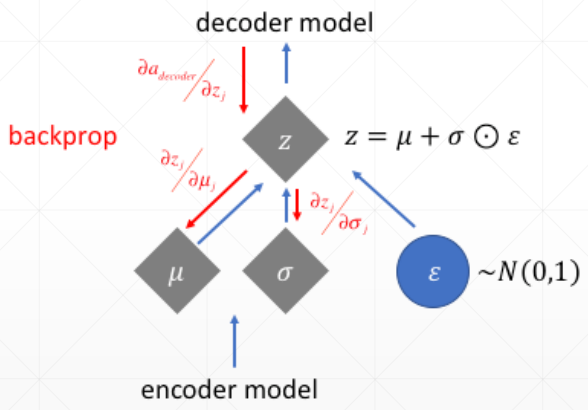

将取样的过程拆除出来，模型反向传播的过程就可以避开它，从而可以优化参数 μ 和 σ

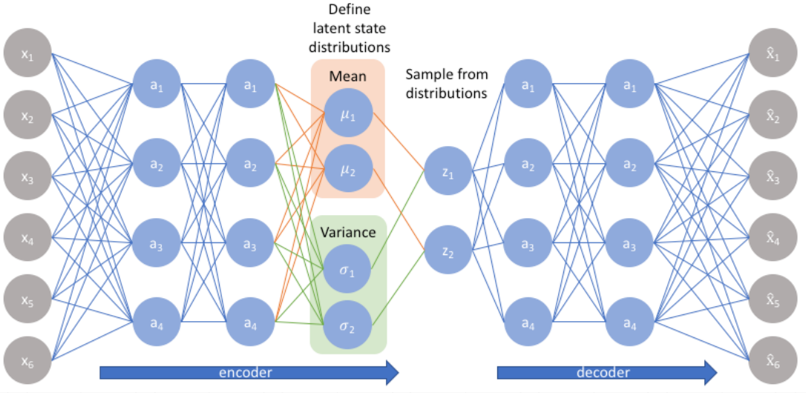

### 应用

通过在分布上取样不同的点，就可以调整生成的结果，如下

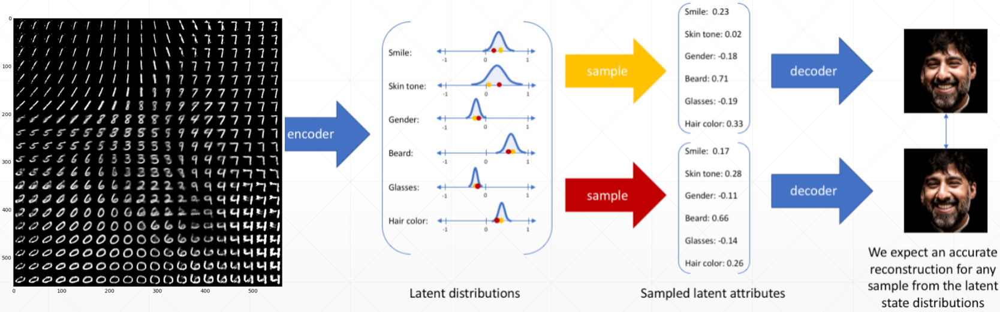

这和 GAN 类似，但实际上自编码器还是重建的是数据本身，无法自己创造出新的数据，而且重建的数据效果也往往没有 GAN 好

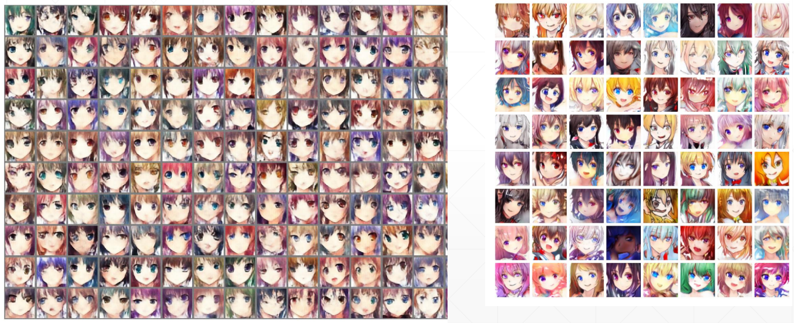

左边是变分自编码器，右边是 GAN

## 代码实战

### Auto-Encoders 代码

```python
import  torch
from    torch import nn

class AE(nn.Module):

    def __init__(self):
        super(AE, self).__init__()


        # [b, 784] => [b, 20]
        self.encoder = nn.Sequential(
            nn.Linear(784, 256),
            nn.ReLU(),
            nn.Linear(256, 64),
            nn.ReLU(),
            nn.Linear(64, 20),
            nn.ReLU()
        )
        # [b, 20] => [b, 784]
        self.decoder = nn.Sequential(
            nn.Linear(20, 64),
            nn.ReLU(),
            nn.Linear(64, 256),
            nn.ReLU(),
            nn.Linear(256, 784),
            nn.Sigmoid()
        )


    def forward(self, x):
        """

        :param x: [b, 1, 28, 28]
        :return:
        """
        batchsz = x.size(0)
        # flatten
        x = x.view(batchsz, 784)
        # encoder
        x = self.encoder(x)
        # decoder
        x = self.decoder(x)
        # reshape
        x = x.view(batchsz, 1, 28, 28)

        return x, None
```

### Variational AutoEncoders 代码

```python
import  torch
from    torch import nn

class VAE(nn.Module):

    def __init__(self):
        super(VAE, self).__init__()
        # [b, 784] => [b, 20]
        # u: [b, 10]
        # sigma: [b, 10]
        self.encoder = nn.Sequential(
            nn.Linear(784, 256),
            nn.ReLU(),
            nn.Linear(256, 64),
            nn.ReLU(),
            nn.Linear(64, 20),
            nn.ReLU()
        )
        # [b, 20] => [b, 784]
        self.decoder = nn.Sequential(
            nn.Linear(10, 64),
            nn.ReLU(),
            nn.Linear(64, 256),
            nn.ReLU(),
            nn.Linear(256, 784),
            nn.Sigmoid()
        )

        self.criteon = nn.MSELoss()

    def forward(self, x):
        """

        :param x: [b, 1, 28, 28]
        :return:
        """
        batchsz = x.size(0)
        # flatten
        x = x.view(batchsz, 784)
        # encoder
        # [b, 20], including mean and sigma
        h_ = self.encoder(x)
        # [b, 20] => [b, 10] and [b, 10]
        mu, sigma = h_.chunk(2, dim=1)
        # reparametrize trick, epison~N(0, 1)
        h = mu + sigma * torch.randn_like(sigma)

        # decoder
        x_hat = self.decoder(h)
        # reshape
        x_hat = x_hat.view(batchsz, 1, 28, 28)

        kld = 0.5 * torch.sum(
            torch.pow(mu, 2) +
            torch.pow(sigma, 2) -
            torch.log(1e-8 + torch.pow(sigma, 2)) - 1
        ) / (batchsz*28*28)

        return x_hat, kld
```

### Main 代码

```python
import  torch
from    torch.utils.data import DataLoader
from    torch import nn, optim
from    torchvision import transforms, datasets

from    ae import AE
from    vae import VAE

import  visdom

def main():
    mnist_train = datasets.MNIST('mnist', True, transform=transforms.Compose([
        transforms.ToTensor()
    ]), download=True)
    mnist_train = DataLoader(mnist_train, batch_size=32, shuffle=True)


    mnist_test = datasets.MNIST('mnist', False, transform=transforms.Compose([
        transforms.ToTensor()
    ]), download=True)
    mnist_test = DataLoader(mnist_test, batch_size=32, shuffle=True)

    x, _ = iter(mnist_train).next()
    print('x:', x.shape)

    device = torch.device('cuda')
    # model = AE().to(device)
    model = VAE().to(device)
    criteon = nn.MSELoss()
    optimizer = optim.Adam(model.parameters(), lr=1e-3)
    print(model)

    viz = visdom.Visdom()

    for epoch in range(1000):

        for batchidx, (x, _) in enumerate(mnist_train):
            # [b, 1, 28, 28]
            x = x.to(device)

            x_hat, kld = model(x)
            loss = criteon(x_hat, x)

            if kld is not None:
                elbo = - loss - 1.0 * kld
                loss = - elbo

            # backprop
            optimizer.zero_grad()
            loss.backward()
            optimizer.step()

        print(epoch, 'loss:', loss.item(), 'kld:', kld.item())

        x, _ = iter(mnist_test).next()
        x = x.to(device)
        with torch.no_grad():
            x_hat, kld = model(x)
        viz.images(x, nrow=8, win='x', opts=dict(title='x'))
        viz.images(x_hat, nrow=8, win='x_hat', opts=dict(title='x_hat'))

if __name__ == '__main__':
    main()
```
