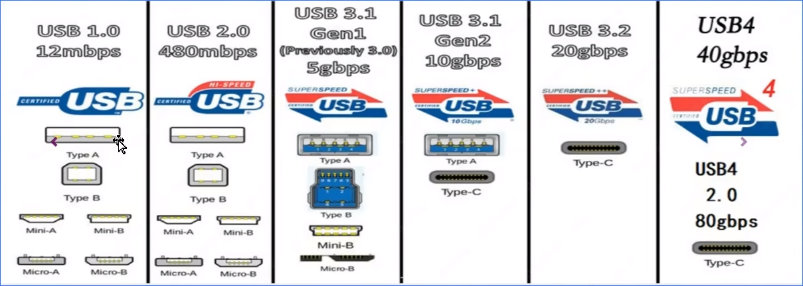
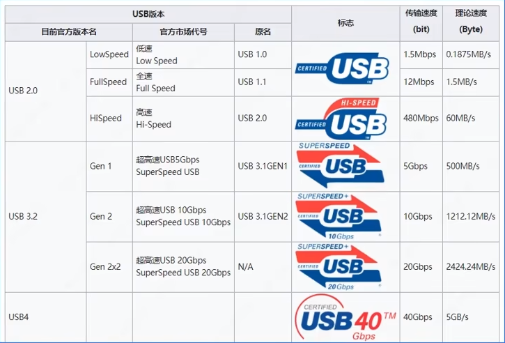
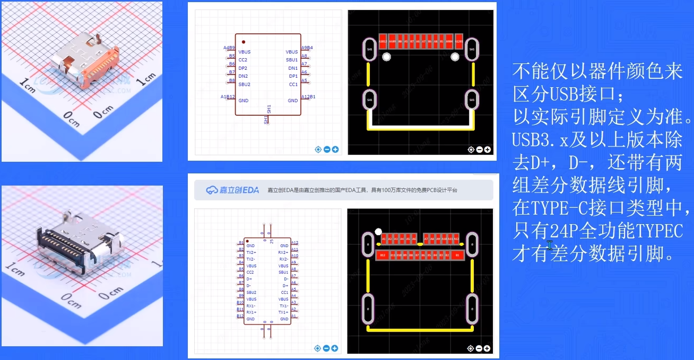
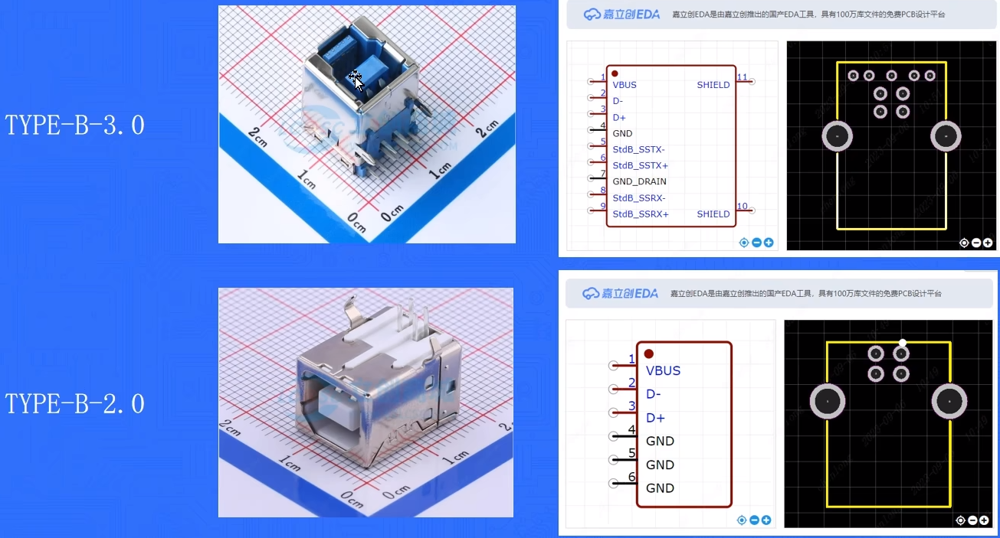

# USB接口介绍

> 参考视频：[四层板PCB设计保姆级教程（1）：3.0HUB设计概述](https://www.bilibili.com/video/BV1nj411v7Lu/)

## USB 接口定义

USB 是通用串行总线的英文缩写，也是一种输入输出接口的技术规范，被广泛的应用于个人电脑和移动设备等通信产品。

USB 接口自 1994 年推出以来，经过不断的发展，从最初的 USB1.0/1.1，USB2.0，USB3.x，最终发展到如今的 USB4，传输速率也从最开始的 1.5Mbps 提升到了最新的 40Gbps。

需要注意的是，USB 不是某一个接口，每一代 USB 协议都会衍生出一系列支持该通讯速率的接口设备。

下面是一些常见的 USB 接口设备。

​​

## USB 版本区分

目前使用最广泛的是 USB2.0 以及 USB3.x

习惯将 USB3.1Gen1 叫做 USB3.0

将 USB3.1Gen2 叫做 USB3.1

将 USBGen2*2 叫做 USB3.2

​​

## USB 接口选型

​​

​​
