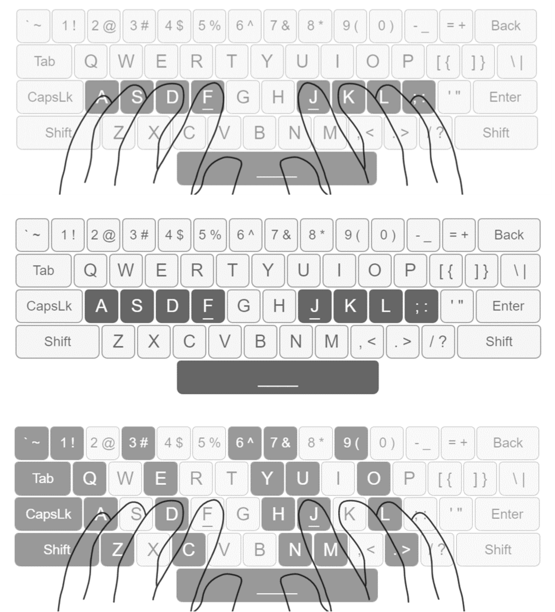
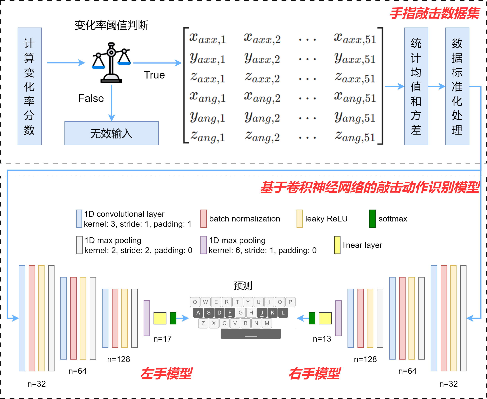
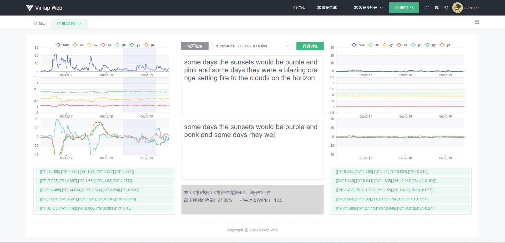
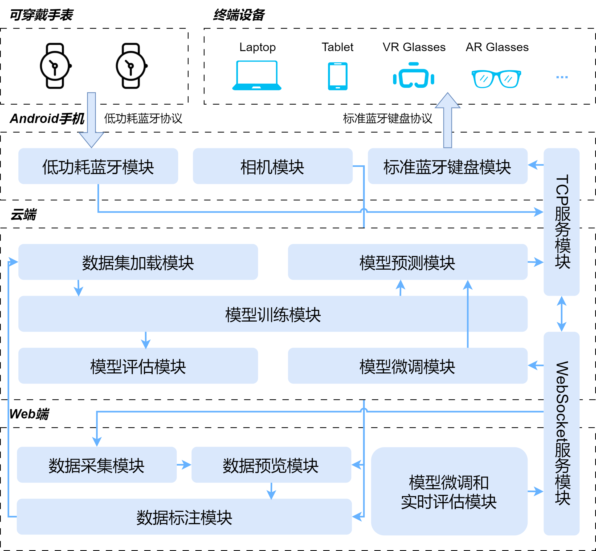
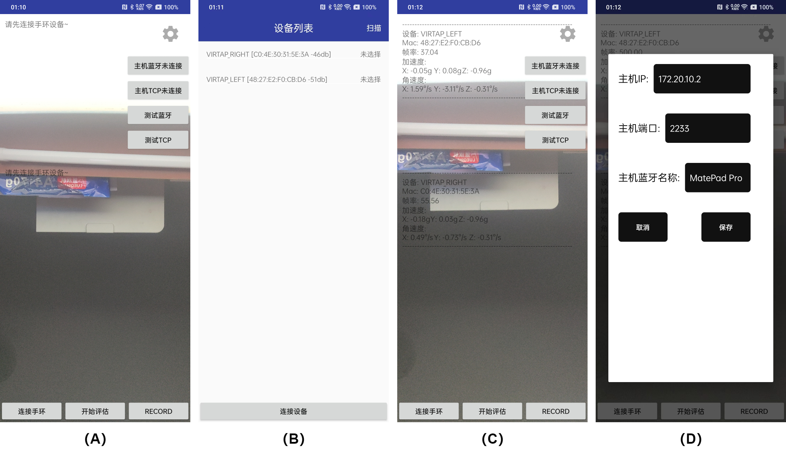
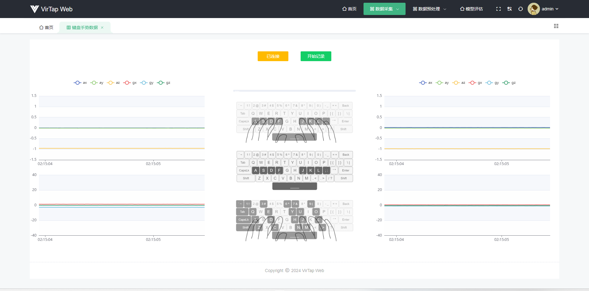
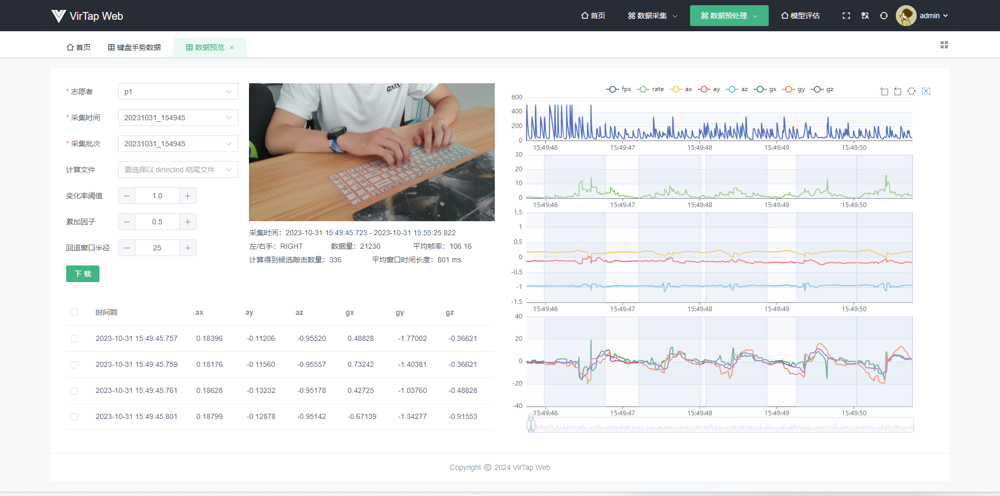
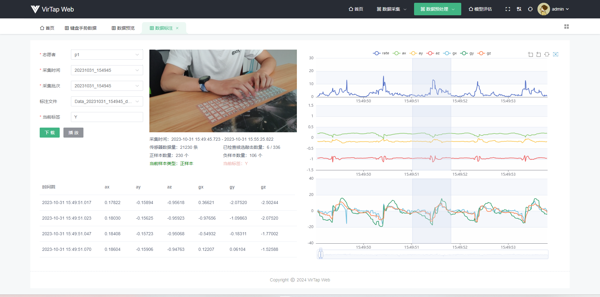
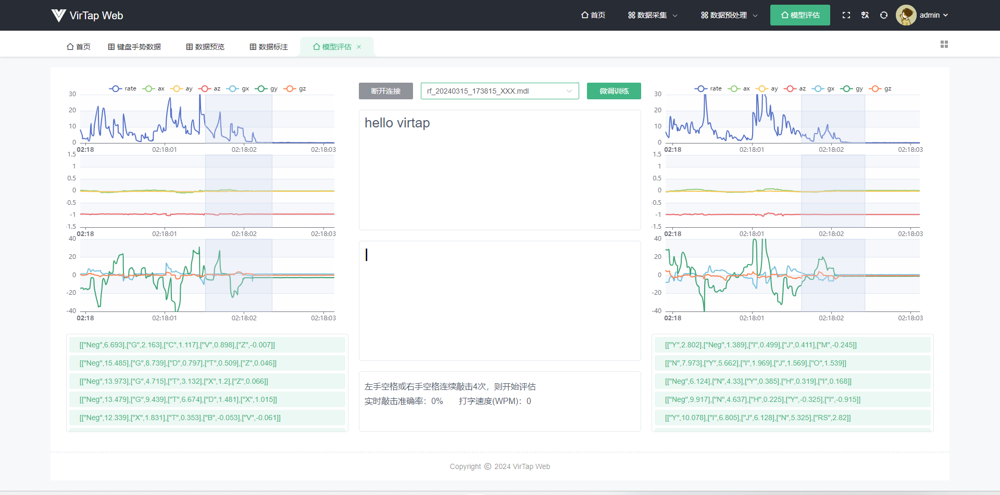
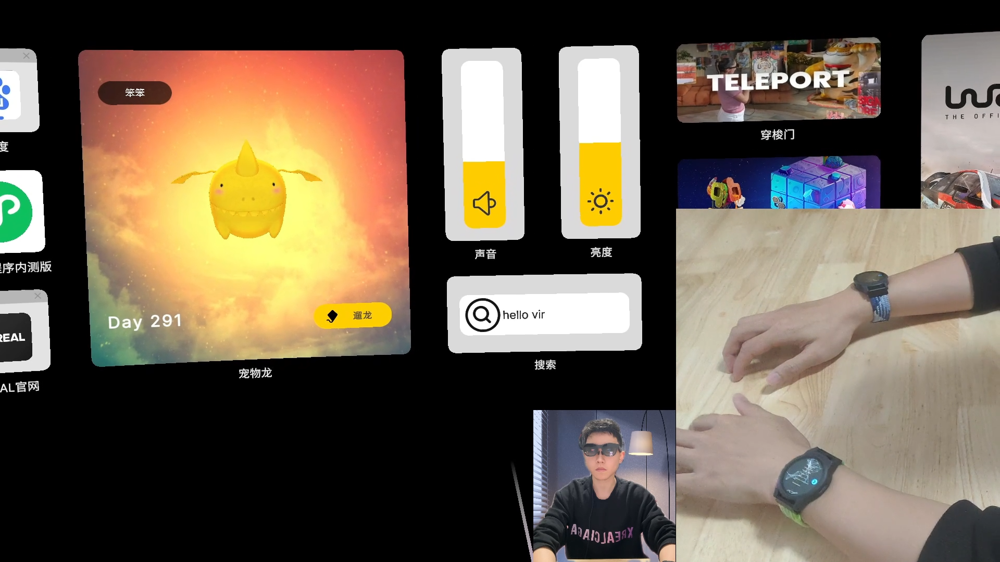

## 视频展示

- name: "VirTap：基于可穿戴传感器的文本输入识别方法研究"
  url: https://pan.aayu.today/workspace/video/VirTap.mp4


## 研究背景

随着增强现实（AR）和虚拟现实（VR）等新兴设备的日益普及，传统的文本输入方式如键盘和鼠标已难以满足用户的需求。现有较成熟的文本输入解决方案一是基于计算机视觉的手势识别，二是依赖手持控制器的文本输入。然而，也存在着诸如设备成本高昂、使用易疲劳、文本输入效率低下等问题。

基于可穿戴传感器的文本输入技术是一种有前景的研究方向。通过佩戴诸如指环、手环和手套等形态的传感器设备，捕捉用户的手指和手部动作，并将其转换为文本信息。但现有研究提出了不同于 QWERTY 标准键盘的输入规则，从而导致输入方式的不直观、不易学和易疲劳。此外，难以广泛应用于不同的终端设备，需要设计特定的接口和软件支持，也限制了该技术的普遍适用性。针对以上不足，本研究探索了一种新的文本输入识别方法，通过手腕可穿戴传感器，结合 QWERTY 键盘的敲击习惯，实现一种更直观、自然和高效的文本输入体验。

## 硬件资源概况

本研究使用六轴姿态传感器 LSM6DSL 获取手指敲击动作的加速度和角速度数据，采样频率设置为 104Hz，加速度计测量范围设置为 ±4G，陀螺仪测量范围设置为 ±2000dps。连续的姿态传感器数据包括了参与者所有的手部动作。为了获取手指的敲击信号，本研究复刻了嘉立创 EDA 开源硬件平台的 QF ZERO V2 开源项目作为后续实验的硬件基础，如图 1 所示。

{width="600px"}

## QWERTY 键盘的标准指法

QWERTY 键盘的标准指法，也被称为触摸打字或盲打，是一种在没有看键盘的情况下打字的技能。这种指法建立在键盘布局和手指位置的记忆上，允许打字者高效且准确地输入文本。示意图如图 2 所示。

{width="600px"}

 **（1）基准位置：** 每只手除拇指外的四个手指被分配给一行特定的键。例如，左手的食指、中指、无名指和小指分别负责“F”、“D”、“S”和“A”键（以及这些键上方和下方的键）。对于右手，食指、中指、无名指和小指分别负责“J”、“K”、“L”和“；”键（以及这些键上方和下方的键）。左手拇指和右手拇指通常用于敲击空格键；

 **（2）盲打定位：** 标准的 QWERTY 键盘上，“F”键和“J”键上会有个突起的小横杠，用于盲打时左手食指和右手食指的定位；

 **（3）打字动作：每次敲击键时，相应的手指应移动到目标键，然后返回到其基准位置。** 这种打字方式确保每个手指负责特定的键，从而提高打字效率。

本研究基于 QWERTY 键盘的标准指法，招募 10 名志愿者采集了 26 个英文字母和空格的手指敲击动作数据，并对其进行标注，最终得到 22107 个标注好的手指敲击动作样本。

## 敲击动作识别模型

本研究通过传感器信号的尖锐变化来判定是否发生敲击事件。基于手指敲击数据集，本研究构建了一个基于卷积神经网络的敲击动作识别模型，如图 3 所示。为了更高效的识别敲击的字符，将手指敲击数据集划分为左手数据集和右手数据集。其中，左手模型输出的样本标签为 15 个英文字母、左手空格和左手负样本标签共 17 个类别；右手模型输出的样本标签为 11 个英文字母、右手空格和右手负样本标签共 13 个类别。整个网络包含约 34k 个可训练参数，在 100 个 epoch 中进行训练，训练的 batch 大小为 16，使用 Adam 优化器，学习率设置为 1e-3，权重衰减设置为 1e-3。

{width="600px"}

打字速度通常使用每分钟字数 WPM 进行评估，公式如下所示：

$$
WPM = \frac{|T|-1}{S} \times 60 \times \frac{1}{5}
$$

式中：|T| 是最终得到的字符串的长度，S 是从输入短语的第一个点击到最后一个点击的经过时间（单位为秒），包括用于纠正输入错误的时间（例如删除)。

本研究通过统计 1 分钟内正确敲击的字符数，除以用来评估的待测试文本总字符数，得到模型实时敲击预测准确率，根据 WPM 公式计算得到打字速度。实验发现，预测准确率和打字速度会随着测试者对 QWERTY 标准指法的熟练程度而上升。经过一段时间的练习以及少量敲击样本的微调后，本研究构建的模型最终可以达到 97.06% 的实时敲击预测准确率，WPM 为 13.6。评估结果如图 4 所示。

## 文本输入识别框架

本研究提出了文本输入识别框架 VirTap，支持任何带有蓝牙功能的终端设备，为其提供文本输入功能，包括但不限于手机、电脑、平板，以及 VR 头显和 AR 眼镜等混合现实设备。框架结构细分为 Web 端模块、云端模块和 Android 端模块。框架的架构和模块间的依赖关系及数据流向可见于图 5。

{width="600px"}

### Android 端界面展示

Android 端界面实现如图 6 所示。应用主界面如（A）所示，相机预览画面占主体显示。当点击连接手环按钮后，应用跳转到（B）所示界面，设备列表展示了扫描到的 BLE 设备，在列表项上单击可选中该设备，支持同时选中多个设备。当 BLE 设备连接成功后，主界面相机预览画面上叠加展示了当前可穿戴设备的数据流信息，如（C）所示。主界面右上角是一个设置按钮，可以用来配置云端 TCP 服务 IP 地址和端口，以及外部终端设备的蓝牙名称，如（D）所示。

### Web 端界面展示

#### 数据采集界面

Web 端数据采集界面如图 7 所示。整体布局划分为三个部分，左右两边展示可穿戴设备实时数据流。中间区域是 QWERTY 标准指法敲击示意图，图片上方是一个进度条和两个按钮。当开始敲击数据采集时，进度条会以 1 秒为周期进行闪动，结合“叮”的音效辅助志愿者完成一次敲击。按钮功能分别是连接云端以及开始或结束敲击数据采集。

#### 数据预览界面

Web 端数据预览界面如图 8 所示。整体布局划分为左右两个部分，左边区域上方展示了当前数据所属志愿者、采集时间、采集批次，以及候选敲击数据检测算法的三个超参数。下方是敲击数据的表格展示。整体布局的右边区域就是通过折线图形式展示的敲击数据。通过该界面可以对采集到的敲击数据进行预处理，得到候选敲击数据并高亮显示。通过下载按钮可以对预处理后的数据文件进行保存。

#### 数据标注界面

数据标注界面如图 9 所示。整体布局和数据预览界面非常相似，左上角区域去掉了候选敲击数据检测算法的三个超参数，添加了一个文本输入框用来标记当前样本标签。图表组件隐藏了 FPS 帧率图显示，只对当前正在校验的候选敲击数据进行高亮显示。下载按钮旁边添加了一个播放按钮，用来控制是否开启视频组件的敲击片段循环播放功能。

#### 模型评估界面

模型评估界面如图 10 所示。和数据采集界面类似，整体布局划分为了三个部分，左右两边展示可穿戴设备实时敲击数据流。数据流下方是云端反馈的敲击预测 Top5 结果及其置信度分数。中间区域从上往下被划分为 4 个部分。第一部分是两个按钮和一个下拉选择框。当成功连接云端后，可以从下拉列表中选择一个模型进行评估。第二部分和第三部分是两个文本展示区域，用来展示待实时评估的文本和开启评估后的敲击预测结果。中间区域最下方是评估结果展示区域，显示实时敲击准确率和打字速度评估结果。

### 框架支持的场景

#### 在手机、电脑、平板等智能设备中的文本输入

以 iPhone 15 Pro 手机为例，接入 VirTap 的流程为：（1）打开框架 Android 端应用程序；（2）在 iPhone 手机蓝牙设置界面扫描到 Android 设备后，点击设备进行连接；（3）在 Android 端应用程序设置界面配置云端 IP 地址、端口和 iPhone 设备的蓝牙名称；（4）点击按钮连接云端和终端设备；（5）佩戴手表，激活六轴姿态传感器，连接手表至 Android 端应用程序；（6）当左手或右手连续敲击空格 4 次即可开始为 iPhone 手机提供文本输入功能。图 11 场景照片展示了 VirTap 框架正在为 iPhone 15 Pro 提供文本输入功能。

#### 在混合现实场景中的文本输入

图 12 展示了混合现实场景中的文本输入。用到的设备是 XREAL Air2 AR 眼镜。XREAL Air2 眼镜连接带 DP（DisplayPort）视频信号输出功能的设备，如手机、平板、或空间计算终端才可开启 AR 体验。在本场景演示中，通过将 XREAL Air2 AR 眼镜连接至华为平板，华为平板接入 VirTap 框架中，实现在 AR 空间中的文本输入功能。

## 未来展望

后续我肯定还会继续基于这个研究捣鼓下去，想探索一下基于 **Beam Pro** 以及上面的**搜狗输入法 XREAL 版**，将双手十指敲击动作映射为类似「 拼音九键 」一样的输入，不再映射成 26 个英文字符，能进一步提高打字准确率和打字效率~

## 硬件资源链接

QF ZERO V2 智能手表终端：https://oshwhub.com/dhx233/esp32_s3_watch
